# 前言

1. ★：录音中提到的
2. ✦：推测考点
3. 致谢：hwl，lqx，ly，sw
4. 重点来源：7-8班 PPT和录音
5. 内容来源：PPT
6. 知识点大多很抽象，需要联系实际代码来理解
7. 多做1-9章课后习题，编程题可以不做
8. [获取最新版本](https://github.com/3210448723/SoftwareTestCourse)
9. [可参考](https://blog.csdn.net/yuhaowu0422/article/details/121601276)

# 题型

1. 选择题（10小题×2分，共20分，不写多选为单选）：分散在各个章节，大部分单选
2. 判断题（10小题×1分，共10分）：分散在各个章节
3. 简答题（5小题×6分，共30分）
4. 程序代码填空题（14空×2分，共28分）：主要涉及2-5章的内容，建议熟悉相关的实战演练
5. 论述题（12分）

# 第1章 安卓基础入门

## Android

###  定义★

* 安卓（Android）是一种基于Linux内核（不包含GNU组件）的自由及开放源代码的操作系统。
* Android是Google公司基于Linux平台开发的手机及平板电脑的操作系统，它自问世以来，受到了前所未有的关注，并迅速成为移动平台最受欢迎的操作系统之一。

### 特点

> chatGPT 3.5

1. 开源性：Android 操作系统是开源的，这意味着开发人员可以自由地访问和修改其源代码，以满足特定的需求。
2. 多任务处理：Android 支持多任务处理，用户可以在同一时间内运行多个应用程序，并且轻松地在应用程序之间切换。
3. 高度定制化：Android 允许用户对操作系统进行高度定制，包括更换主题、更改桌面图标、添加小部件等。
4. 应用程序生态系统：Android 拥有一个庞大的应用程序生态系统，用户可以轻松地从 Google Play 商店中下载和安装各种应用程序。
5. 广泛的设备支持：Android 支持广泛的设备，包括手机、平板电脑、智能手表、智能电视等，这使得 Android 成为一个非常流行的操作系统。
6. 硬件支持：Android 支持各种硬件设备，包括相机、GPS、蓝牙、加速度计和陀螺仪等，这使得开发人员可以创建各种有用的应用程序。
7. 安全性：Android 拥有强大的安全功能，包括应用程序沙箱、权限管理和安全更新等。
8. 开发工具支持：Android 提供了丰富的开发工具和平台，包括 Android Studio、SDK、NDK 等，这使得开发人员可以轻松地创建高质量的应用程序。

### 体系结构

#### 层次★

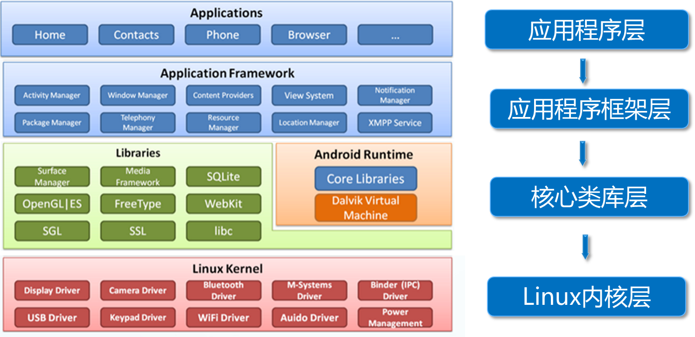

#### 特点

Android系统架构从高到低分为四层，分别为依次是应用程序层（Applications）、应用程序框架层（Application Framework）、核心类库（Libraries）和Linux内核（Linux Kernel），各层的特点具体如下：

1. 应用程序层：一个核心应用程序的集合，安装在手机中的应用程序都属于这一层。
2. 应用程序架构层：主要提供了构建应用程序时用到的各种API。例如活动管理器（Activity Manager）。
3. 核心类库：主要包含了系统库和Android运行环境。
4. Linux内核：它为Android设备的各种硬件提供了底层的驱动，如，显示驱动、音频驱动。

### 资源的管理与使用

> 了解一下

#### 图片资源

##### 扩展名

.png、.jpg、.gif、.9.png等

##### 分类

###### 应用图标资源

存放在mipmap文件夹中

###### 界面中使用的图片资源

存放在drawable文件夹中

##### 屏幕密度匹配规则

| 密度范围值 | mipmap文件夹  | drawable文件夹  |
| ---------- | ------------- | --------------- |
| 120~160dpi | mipmap_mdpi   | mipmap_mdpi     |
| 160~240dpi | mipmap_hdpi   | drawable_hdpi   |
| 240~320dpi | mipmap_xdpi   | drawable_xdpi   |
| 320~480dpi | mipmap_xxdpi  | drawable_xxdpi  |
| 480~640dpi | mipmap_xxxdpi | drawable_xxxdpi |

##### 调用方式

###### 通过Java代码调用图片资源

```java
   //调用mipmap文件夹中资源文件
   getResources().getDrawable(R.mipmap.ic_launcher);
   //调用以drawable开头的文件夹中的资源文件
   getResources().getDrawable(R.drawable.icon); 
```

###### 在XML布局文件中调用图片资源

```xml
   @mipmap/ic_launcher   //调用mipmap文件夹中的资源文件
   @drawable/icon        //调用以drawable开头的文件夹中的资源文件
```

#### 主题和样式资源

##### 主题

###### 定义

包含一种或多种格式化属性的集合，在程序中调用主题资源可改变窗体的样式。

###### 定义位置

`res/values`目录下的`styles.xml`文件中

```xml
  <!-- name:用于指定主题名称 parent:用于指定继承的父主题 -->
  <style name="AppTheme" parent="Theme.AppCompat.Light.DarkActionBar">
        <item name="colorPrimary">@color/colorPrimary</item>
        <item name="colorPrimaryDark">@color/colorPrimaryDark</item>
        <item name="colorAccent">@color/colorAccent</item>
  </style>
```

###### 调用主题

1. 在AndroidManifest.xml文件中设置主题

   ```xml
     <application
                  ...
                  android:theme ="@style/AppTheme">
   ```

2. 方法二：在Java代码中设置主题

   ```java
     setTheme(R.style.AppTheme);
   ```

##### 样式

###### 定义

设置View的宽度、高度和背景颜色等信息。

###### 定义位置

`res/values`目录下的`styles.xml`文件中

```xml
<style name="btnStyle">
	<item name="android:layout_width">wrap_content</item>
    <item name="android:layout_height">match_parent</item>
    <item name="android:textSize">20sp</item>
</style>
```

###### 调用样式

在XML布局文件中引用样式

```xml
<Button
	style="@style/btnStyle"
        android:text="+"/>
```

#### 布局资源

##### 定义

通常用于搭建程序中的各个界面。

##### 存放位置

`res/layout`文件夹中

##### 调用方式

###### 通过Java代码调用布局资源文件

```java
  //在Activity的onCreate()方法中调用activity_main.xml布局文件
  setContentView(R.layout.activity_main);
```

###### 在XML布局文件中调用布局资源文件

```xml
  //在XML布局文件中调用activity_main.xml布局文件
  <include layout="@layout/activity_main"/>
```

#### 字符串资源

##### 定义

用于显示界面上的文本信息。

##### 定义位置

res/values目录下的strings.xml文件中

```xml
 <resources>
      <string name="app_name">字符串</string>
 </resources>
```

##### 通过Java代码调用字符串资源

```java
   getResources().getString(R.string.app_name); 
```

##### 在XML布局文件中调用字符串资源

```xml
   @string/app_name 
```

#### 颜色资源

##### 定义

用于显示控件的不同色彩效果。

##### 定义位置

`res/values/colors.xml`文件中

```xml
  <resources>
       <color name="colorPrimary">#3F51B5</color>
  </resources>
```

##### 调用方式

###### 通过Java代码调用颜色资源

```java
   getResources().getColor(R.color.colorPrimary);   
```

###### 在XML布局文件中调用颜色资源

```xml
   @color/colorPrimary
```

#### 尺寸资源

##### 定义

用于设置View的宽高和View之间的间距值。

##### 定义位置

`res/values/dimens.xml`文件中，如果程序中没有dimens.xml文件，可自行创建。

```xml
  <resources>
       <dimen name="activity_horizontal_margin">16dp</dimen>
  </resources>
```

##### 调用方式

###### 通过Java代码调用尺寸资源

```java
   getResources().getDimension(R.dimen.activity_horizontal_margin);    
```

###### 在XML布局文件中调用尺寸资源

```xml
   @dimen/activity_horizontal_margin
```

### 四大组件

1. Activity组件，它一个单独的窗口，程序流程都必须在【Activity】中运行，所有它是最基本的模块。
2. service组件，用于在后台完成用户指定的操作。
3. content provider组件，会为所有的应用准备一个内容窗口，并且保留数据库、文件。
4. broadcast receiver组件，是程序之间传递信息时的一种机制，作用就是接收或者发送通知。

## Logcat※

### 定义

LogCat是Android中的命令行工具，用于获取程序从启动到关闭的日志信息。

### 日志级别

| **级别**   | **显示信息**         | **日志信息颜色** | Log类中的静态方法 |
| ---------- | -------------------- | ---------------- | ----------------- |
| verbose(V) | 全部信息             | 黑色             | Log.v()           |
| debug(D)   | 调试信息             | 蓝色             | Log.d()           |
| info(I)    | 一般信息             | 绿色             | Log.i()           |
| warning(W) | 警告信息             | 橙色             | Log.w()           |
| error(E)   | 错误信息             | 红色             | Log.e()           |
| assert     | 断言失败后的错误消息 | 红色             | Log.wtf()         |

# 第2章 安卓常见界面布局

> 了解四种布局的属性的设置和含义

Android的常见布局都直接或间接地继承自ViewGroup类

| 常用布局 | 特点                               |
| -------- | ---------------------------------- |
| 线性布局 | 以水平或垂直方向排列               |
| 相对布局 | 通过相对定位排列                   |
| 帧布局   | 开辟空白区域，帧里的控件（层）叠加 |
| 表格布局 | 表格形式排列                       |

##  通用属性

| 属性名称              | 功能描述                                 | 属性值                                            |
| --------------------- | ---------------------------------------- | ------------------------------------------------- |
| android:id            | 设置布局的标识                           | "@+id/属性名称"                                   |
| android:layout_width  | 设置布局的宽度                           | 具体尺寸、fill_parent、match_parent、wrap_content |
| android:layout_height | 设置布局的宽度                           | 具体尺寸、fill_parent、match_parent、wrap_content |
| android:background    | 设置布局的背景                           | 引用图片资源、引用颜色资源                        |
| android:layout_margin | 设置当前布局与屏幕边界或与周围控件的距离 | 具体的尺寸，如45dp                                |
| android:padding       | 设置当前布局与该布局中控件的距离         | 具体的尺寸，如45dp                                |

## 线性布局

### 定义/特点

LinearLayout（线性布局）可通过android:orientation属性指定该布局内的子控件水平和竖直排列。

### 基本语法格式

```xml
<LinearLayout 
   xmlns:android="http://schemas.android.com/apk/res/android"
        属性 = "属性值"
        ......>
</LinearLayout>
```

### 常用属性

| 属性名称                | 功能描述                                  |
| ----------------------- | ----------------------------------------- |
| `android:orientation`   | 设置布局内控件的排列顺序                  |
| `android:layout_weight` | 在布局内设置控件权重，属性值可直接写int值 |

1. 属性android:orientation的值为可选值，可选值为vertical和horizontal。
   1. vertical：表示LinearLayout布局内控件依次从上到下竖直排列。
   2. horizontal：默认值，表示LinearLayout布局内控件依次从左到右水平排列。
2. 属性android:layout_weight
   1. 该属性被称为权重，通过设置该属性值，可使布局内的控件按照权重比显示大小。
   2. 在进行屏幕适配时起到关键作用。
   3. 当控件使用权重属性时，布局宽度`android:layout_width`属性值通常设置为0dp，使得布局宽度由权重占比决定而不是设定值决定

## 相对布局

### 定义/特点

RelativeLayout（相对布局）通过相对定位的方式指定子控件的位置。在XML布局文件中定义相对布局时使用`<RelativeLayout>`标签。

### 基本语法格式

```xml
<RelativeLayout 
        xmlns:android="http://schemas.android.com/apk/res/android"
        属性 = "属性值"
        ......>
</RelativeLayout>
```

### 常用属性

| 属性名称                         | 功能描述                                 |
| -------------------------------- | ---------------------------------------- |
| android:layout_centerInParent    | 设置当前控件位于父布局的中央位置         |
| android:layout_centerVertical    | 设置当前控件位于父布局的垂直居中位置     |
| android:layout_centerHorizontal  | 设置当前控件位于父控件的水平居中位置     |
| android:layout_above             | 设置当前控件位于某控件上方               |
| android:layout_below             | 设置当前控件位于某控件下方               |
| android:layout_toLeftOf          | 设置当前控件位于某控件左侧               |
| android:layout_toRightOf         | 设置当前控件位于某控件右侧               |
| android:layout_alignParentTop    | 设置当前控件是否与父控件顶端对齐         |
| android:layout_alignParentLeft   | 设置当前控件是否与父控件左对齐           |
| android:layout_alignParentRight  | 设置当前控件是否与父控件右对齐           |
| android:layout_alignParentBottom | 设置当前控件是否与父控件底端对齐         |
| android:layout_alignTop          | 设置当前控件的上边界与某控件的上边界对齐 |
| android:layout_alignBottom       | 设置当前控件的下边界与某控件的下边界对齐 |
| android:layout_alignLeft         | 设置当前控件的左边界与某控件的左边界对齐 |
| android:layout_alignRight        | 设置当前控件的右边界与某控件的右边界对齐 |

## 表格布局

### 定义/特点

TableLayout（表格布局）采用行、列的形式来管理控件，通过在TableLayout布局中添加TableRow布局或控件来控制表格的行数，可以在TableRow布局中添加控件来控制表格的列数。一个TableRow代表一行，在TableRow中添加的控件代表一列。

### 基本语法格式

```xml
<TableLayout xmlns:android="http://schemas.android.com/apk/res/android"
       属性 = "属性值">
       <TableRow>
             UI控件
       </TableRow>
        UI控件
        ......
</TableLayout>
```

### 常用属性

TableLayout继承自LinearLayout，因此它完全支持LinearLayout所支持的属性

#### 继承LinearLayout

| 属性名称                | 功能描述                                  |
| ----------------------- | ----------------------------------------- |
| `android:orientation`   | 设置布局内控件的排列顺序                  |
| `android:layout_weight` | 在布局内设置控件权重，属性值可直接写int值 |

#### 其它常用属性

##### 表格布局属性

| 属性名称                | 功能描述       |
| ----------------------- | -------------- |
| android:stretchColumns  | 设置该列被拉伸 |
| android:shrinkColumns   | 设置该列被收缩 |
| android:collapseColumns | 设置该列被隐藏 |

##### 表格布局中控件的常用属性

| 属性名称              | 功能描述                        |
| --------------------- | ------------------------------- |
| android:layout_column | 设置该单元显示位置              |
| android:layout_span   | 设置该单元格占据几行，默认为1行 |

## 帧布局

### 定义/特点

FrameLayout（帧布局）用于在屏幕上创建一块空白区域，添加到该区域中的每个子控件占一帧，这些帧会一个一个叠加在一起，后加入的控件会叠加在上一个控件上层。默认情况下，帧布局中的所有控件会与左上角对齐。

### 基本语法格式

```xml
<FrameLayout xmlns:android="http://schemas.android.com/apk/res/android"
      属性 ="属性值">
</FrameLayout>
```

### 常用属性

| 属性名称                  | 功能描述                                         |
| ------------------------- | ------------------------------------------------ |
| android:foreground        | 设置帧布局容器的前景图像（始终在所有子控件之上） |
| android:foregroundGravity | 设置前景图像显示的位置                           |

# 第3章 Android 常用界面控件

> 对于属性，可能会考更换属性值是否可行

## 简单控件

> 要熟悉

### TextView

#### 定义

TextView控件用于显示文本信息，我们可以在XML布局文件中以添加属性的方式来控制TextView控件的样式

#### 常用属性

| **属性名称**             | **功能描述**                                                 |
| ------------------------ | ------------------------------------------------------------ |
| android:layout_width     | 设置TextView控件的宽度                                       |
| android:layout_height    | 设置TextView控件的高度                                       |
| android:id               | 设置TextView控件的唯一标识                                   |
| android:background       | 设置TextView控件的背景                                       |
| android:layout_margin    | 设置当前控件与屏幕边界或周围控件、布局的距离                 |
| android:padding          | 设置TextView控件与该控件中内容的距离                         |
| android:text             | 设置文本内容                                                 |
| android:textColor        | 设置文字显示的颜色                                           |
| android:textSize         | 设置文字大小，推荐单位为sp                                   |
| android:gravity          | 设置文本内容的位置                                           |
| android:maxLength        | 设置文本最大长度，超出此长度的文本不显示                     |
| android:lines            | 设置文本的行数，超出此行数的文本不显示                       |
| android:maxLines         | 设置文本的最大行数，超出此行数的文本不显示。                 |
| android:ellipsize        | 设置当文本超出TextView规定的范围的显示方式。                 |
| android:drawableTop      | 在文本的顶部显示图像                                         |
| android:lineSpacingExtra | 设置文本的行间距                                             |
| android:textStyle        | 设置文本样式，如bold（粗体），italic（斜体），normal（正常） |

### EditText

#### 定义

EditText表示编辑框，它是TextView的子类，用户可在此控件中输入信息。

#### 常用属性

除了支持`TextView`控件的属性外，EditText还支持一些其它的常用属性，这些常用属性如下表所示。

| 属性名称                   | 功能描述                                             |
| -------------------------- | ---------------------------------------------------- |
| android:hint               | 控件中内容为空时显示的提示文本信息                   |
| android:textColorHint      | 控件中内容为空时显示的提示文本信息的颜色             |
| android:password           | 输入文本框中的内容显示为“.”                          |
| android:phoneNumber        | 设置输入文本框中的内容只能是数字                     |
| android:maxLines           | 设置文本的最大行数                                   |
| android:scrollHorizontally | 设置文本信息超出EditText的宽度情况下，是否出现横拉条 |
| android:editable           | 设置是否可编辑                                       |

### Button

> 在xml中是如何定义的

#### 定义

Button控件表示按钮，它继承TextView控件，既可以显示文本，又可以显示图片，同时也允许用户通过点击来执行操作，当Button控件被点击时，被按下与弹起的背景会有一个动态的切换效果，这个效果就是点击效果。

#### 常用属性

> chatGPT 3.5

| **属性名称**           | **属性描述**                        | **可选值示例**                    |
| ---------------------- | ----------------------------------- | --------------------------------- |
| android:id             | Button 的唯一标识符                 | @+id/my_button                    |
| android:text           | Button 上显示的文本                 | "Hello"                           |
| android:textSize       | Button 上文本的大小                 | "12sp"                            |
| android:textColor      | Button 上文本的颜色                 | "#FF0000"                         |
| android:background     | Button 的背景                       | "@drawable/my_button_bg"          |
| android:layout_width   | Button 的宽度                       | "wrap_content"  或 "match_parent" |
| android:layout_height  | Button 的高度                       | "wrap_content"  或 "match_parent" |
| android:layout_gravity | Button 在父容器中的对齐方式         | "center"  或 "right"              |
| android:layout_margin  | Button 与其他视图之间的边距         | "10dp"                            |
| android:padding        | Button 内容与 Button 边缘之间的距离 | "5dp"                             |
| android:enabled        | Button 是否可用                     | "true"  或 "false"                |
| android:focusable      | Button 是否可被聚焦                 | "true"  或 "false"                |
| android:clickable      | Button 是否可被点击                 | "true"  或 "false"                |
| android:onClick        | Button 被点击时的响应函数           | "myButtonClick"                   |

#### 点击事件设置方式★

> 每年都考

##### 在布局文件中指定onClick属性的方式设置点击事件

```xml
<Button
     ......
     android:onClick="click" />
```

##### 使用匿名内部类的方式设置点击事件

```java
btn.setOnClickListener(new View.OnClickListener() {
     @Override
     public void onClick(View view) {
          //实现点击事件的代码
     }
});
```

##### Activity实现OnClickListener接口的方式设置点击事件

> 注意：实现Button控件的点击事件的三种方式中，前两种方式适合界面上Button控件较少的情况，如果界面上Button控件较多时，建议使用第三种方式实现控件的点击事件。

```java
public class Activity extends AppCompatActivity implements View.OnClickListener{
     @Override
     protected void onCreate(Bundle savedInstanceState) {
          ......
         btn.setOnClickListener(this); //设置Button控件的点击监听事件
     }
     @Override
     public void onClick(View view) {
          //实现点击事件的代码
     }
}
```

### ImageView

#### 定义

ImageView控件表示图片，它继承自View，可以加载各种图片资源。

#### 常用属性

| 属性名称              | 功能描述                                        |
| --------------------- | ----------------------------------------------- |
| android:layout_width  | 设置ImageView控件的宽度                         |
| android:layout_height | 设置ImageView控件的高度                         |
| android:id            | 设置ImageView控件的唯一标识                     |
| android:background    | 设置ImageView控件的背景                         |
| android:layout_margin | 设置当前控件与屏幕边界或周围控件的距离          |
| android:src           | 设置ImageView控件需要显示的图片资源             |
| android:scaleType     | 将图片资源缩放或移动，以适应ImageView控件的宽高 |
| android:tint          | 将图片渲染成指定的颜色                          |

### RadioButton

#### 定义

RadioButton表示单选按钮，它是Button的子类。每一个单选按钮都有“选中”和“未选中”两种状态，这两种状态是通过android:checked属性指定的。当可选值为true时，表示选中状态，否则，表示未选中状态。

#### 基本语法格式

```xml
<RadioGroup
         android:属性名称 ="属性值"
         ......>
	<RadioButton
	       android:属性名称 ="属性值"
                         ...... />
	......
<RadioGroup/>
```

### CheckBox

#### 定义

CheckBox表示复选框，它是Button的子类，用于实现多选功能。每一个复选框都有“选中”和“未选中”两种状态，这两种状态是通过android:checked属性指定的，当该属性的值为true时，表示选中状态，否则，表示未选中状态。

#### 示例

获取选中的复选框的文本属性值，并显示

##### 布局文件

activity_main.xml

```xml
......
<CheckBox
android:layout_width="wrap_content"
android:layout_height="wrap_content"
android:textSize="...sp"
android:text="textname"
android:id="@+id/x"/>
<CheckBox
android:layout_width="wrap_content"
android:layout_height="wrap_content"
android:textSize="...sp"
android:text="textname"
android:id="@+id/y"/>
......
<TextView
android:id="@+id/xy"
android:layout_width="wrap_content"
android:layout_height="wrap_content"
android:textSize="...sp"
android:textColor="#FF8000"/>
```

##### Java文件

MainActivity.java

```java
public class MainActivity extends AppCompatActivity implements
		CompoundButton.OnCheckedChangeListener {
	private TextView xy;
	private String xys;

	@Override
	protected void onCreate(Bundle savedInstanceState) {
		super.onCreate(savedInstanceState);
		setContentView(R.layout.activity_main);
//初始化CheckBox控件
		CheckBox x = (CheckBox) findViewById(R.id.x);
		CheckBox y = (CheckBox) findViewById(R.id.y);
		x.setOnCheckedChangeListener(this);
		y.setOnCheckedChangeListener(this);
		xy = (TextView) findViewById(R.id.xy);
//用来存放选中的CheckBox信息
		xys = new String();
	}

	@Override
	public void onCheckedChanged(CompoundButton buttonView, boolean isChecked) {
// buttonView 表示被点击的控件, isChecked 表示控件状态
		String motion = buttonView.getText().toString();
// 通过 isChecked 判断当前被点击的 CheckBox 是否为选中状态
		if (isChecked) { // 选中状态
			if (!xys.contains(motion)) { // xys 字符串中不包含 CheckBox的文本信息
				xys = xys + motion; // 将文本信息添加到 xys 字符串中
				xy.setText(xys); // 显示在 TextView 上
			} else { // 未选中状态
				if (xys.contains(motion)) { // xys 字符串中包含 CheckBox的文本信息
					xys = xys.replace(motion, ""); // 使用空字符串替换 CheckBox 的文本信息
					xy.setText(xys); // 将返回的 xys 字符串显示在TextView 上
				}
			}
		}
	}
}
```

### Toast

#### 定义

Toast是Android系统提供的轻量级信息提醒机制，用于向用户提示即时消息，它显示在应用程序界面的最上层，显示一段时间后自动消失不会打断当前操作，也不获得焦点。

#### 基本语法格式

```java
Toast.makeText(Context,Text,Time).show();
```

* Context：表示应用程序环境的信息，即当前组件的上下文环境。
* Text：表示提示的字符串信息。
* Time：表示显示信息的时长，其属性值包括Toast.LENGTH_SHORT和Toast.LENGTH_LONG，分别表示显示较短时间和较长时间。

#### 示例

使用Toast提示用户“WIFI已断开”的信息

```java
Toast.makeText(MainActivity.this, "WIFI已断开", Toast.LENGTH_SHORT).show();
```

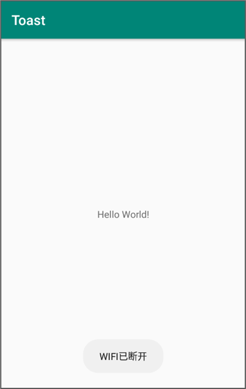

### 实战演练-实现注册页面效果

> 代码看一下

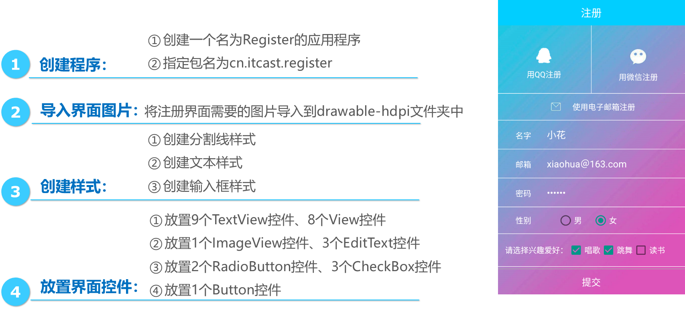

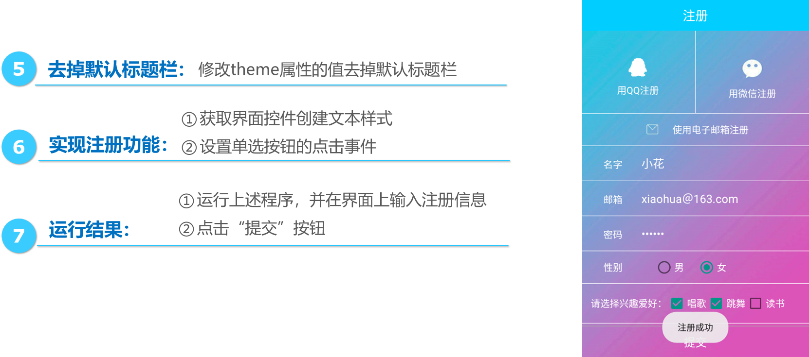


```java
```


## 列表控件

### ListView★

#### 定义/作用

在Android开发中，ListView是一个比较常用的控件，它以**列表**的形式展示数据内容，并且能够根据列表的高度**自适应屏幕**显示。

#### 常用属性

| 属性名称              | 功能描述                           |
| --------------------- | ---------------------------------- |
| android:listSelector  | 当条目被点击后，改变条目的背景颜色 |
| android:divider       | 设置分割线的颜色                   |
| android:dividerHeight | 设置分割线的高度                   |
| android:scrollbars    | 是否显示滚动条                     |
| android:fadingEdge    | 去掉上边和下边的黑色阴影           |

#### 基本语法格式

```xml
<?xml version="1.0" encoding="utf-8"?>
<RelativeLayout 
        ......>
       <ListView
            android:id="@+id/lv"
            android:layout_width="match_parent"
            android:layout_height="match_parent"
            android:listSelector="#fefefefe"
            android:scrollbars="none">
       </ListView>
</RelativeLayout>
```

#### 特点※

> chatGPT 3.5

1. 显示大量数据：ListView可以显示大量的数据，可以通过滚动来查看所有的数据。
2. 可以自定义布局：ListView可以使用自定义的布局来显示列表项，可以根据需要自定义每个列表项的布局和样式。
3. 支持滚动：ListView支持滚动，可以通过手指滑动或代码控制滚动。
4. 支持点击事件：ListView支持点击事件，可以为每个列表项设置点击事件，响应用户的点击操作。
5. 支持多选：ListView支持多选，可以为每个列表项设置选择状态，支持单选和多选。
6. 支持分割线：ListView支持分割线，可以为列表项之间添加分割线，使列表更加美观。
7. 支持数据源更新：ListView支持数据源更新，可以动态地添加、删除、修改列表项，同时更新列表的显示。

### 数据适配器

#### 定义/作用

数据适配器是**数据与视图之间的桥梁**，它类似于一个转换器，将复杂的数据转换成用户可以接受的方式进行呈现。

#### BaseAdapter

BaseAdapter顾名思义是**基本的适配器**。它实际上是一个**抽象类**，通常在自定义适配器时会继承BaseAdapter，该类拥有四个抽象方法，根据这几个抽象方法对ListView控件进行数据适配。BaseAdapter中的4个抽象方法如下表所示。

| **方法名称**                                                 | **功能描述**                                                 |
| ------------------------------------------------------------ | ------------------------------------------------------------ |
| public int getCount()                                        | 获取列表条目的总数                                           |
| public Object getItem(int position)                          | 根据position（位置）获取某个条目的对象                       |
| public long getItemId(int position)                          | 根据position（位置）获取某个条目的id                         |
| public View getView(int position, View  convertView, ViewGroup parent) | 获取相应position对应的条目视图，position是当前条目的位置，convertView用于复用旧视图，parent用于加载XML布局。 |

#### SimpleAdapter

SimpleAdapter继承BaseAdapter，实现了BaseAdapter的四个抽象方法并进行封装。SimpleAdapter的构造方法的具体信息如下：

```java
  public SimpleAdapter(Context context, List<? extends Map<String, ?>> data,int resource, 
  String[] from, int[] to)
```

* context：表示上下文对象。
* data：数据集合，data中的每一项对应ListView控件中的条目的数据。
* resource：条目布局的资源id。
* from：Map集合中的key值。
* to：条目布局中对应的控件。

#### ArrayAdapter

ArrayAdapter也是BaseAdapter的子类，用法与SimpleAdapter类似，开发者只需要在构造方法里面传入相应参数即可。ArrayAdapter通常用于**适配TextView控件**，ArrayAdapter有多个构造方法，构造方法的具体信息如下所示。

```java
   public ArrayAdapter(Context context,int resource)；
   public ArrayAdapter(Context context,int resource, int textViewResourceId)；
   public ArrayAdapter(Context context,int resource,T[] objects)；
   public ArrayAdapter(Context context,int resource,int textViewResourceId,T[] objects);
   public ArrayAdapter(Context context,int resource,List<T> objects)；
   public ArrayAdapter(Context context, //上下文对象
                       int resource, //条目布局的资源id
                       int textViewResourceId, //条目布局中对应的TextView控件的id
                       List<T> objects) //需要适配的List类型的数
```

#### 添加数据适配器

在创建数据适配器后，可以通过ListView控件的`setAdapter()`方法添加数据适配器

### 实战演练-购物商城

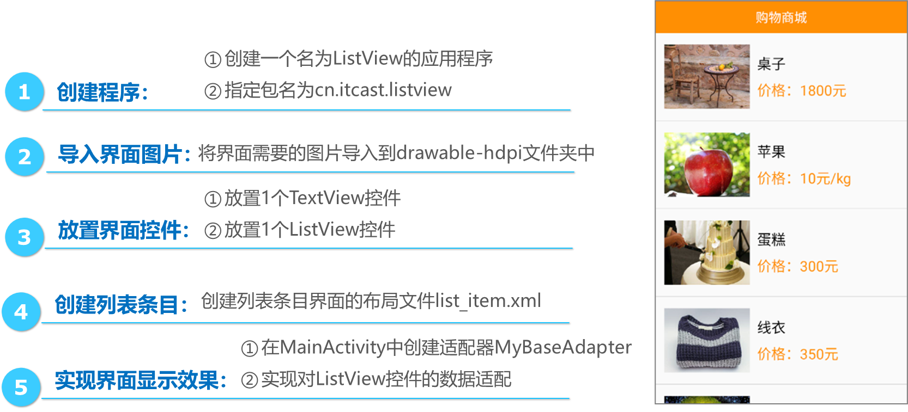

# 第4章 程序活动单元Activity

## 定义/作用✦

Activity表示活动，是一个负责与用户交互的组件，每个Android应用中都会用Activity来显示界面以及处理界面上一些控件的事件。

## Activity 的生命周期★

### 生命周期状态

1. 启动状态

   Activity的启动状态很短暂。当Activity启动之后便会进入运行状态。

2. 运行状态

   Activity处于屏幕最前端,可与用户进行交互。

3. 暂停状态

   Activity仍然可见，但无去获取焦点,用户对它操作没有响应。

4. 停止状态

   Activity完全不可见，系统内存不足时会销毁该Activity。

5. 销毁状态

   Activity将被清理出内存。

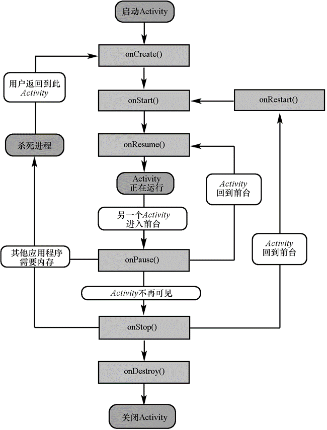

### 生命周期方法

1. onCreate()：Activity创建时调用，通常做一些初始化设置。
2. onStart()：Activity即将可见时调用。
3. onResume()：Activity获取焦点时调用。
4. onPause()：当前Activity被其他Activity覆盖或屏幕锁屏时调用。
5. onStop()：Activity对用户不可见时调用。
6. onRestart()：Activity从停止状态到再次启动时调用。
7. onDestroy()：Activity销毁时调用。

## Activity的创建、配置、启动和关闭

### 配置Activity★

在Android程序中，创建Activity可以使用Java类继承Activity的方式实现。使用此种方式创建Activity时，需要在清单文件的`<application>`标签中配置Acitivity。 

```xml
<?xml version="1.0" encoding="utf-8"?>
<manifest xmlns:android="http://schemas.android.com/apk/res/android">
    <application
            ...>
        <activity android:name="cn.itcast.activitybasic.SecondActivity"/>
    </application>
</manifest>
```

如果Activity所在的包与AndroidManifest.xml文件的`<manifest></manifest>`标签中通过package属性指定的包名一致，则android:name属性的值可以直接设置为“.Activity名称”。

### 启动Activity

```java
Intent intent = new Intent(MainActivity.this,SecondActivity.class);
startActivity(intent); //启动
```

### 关闭Activity

如果想要关闭当前的Activity，可以调用Activity提供的finish()方法。

## Intent与IntentFilter★

> 经常考

### Intent

#### 定义/作用

Intent被称为意图，它不仅可以指定当前组件**要执行的动作**，还可以在不同组件之间进行**数据传递**。

#### 分类

根据**开启目标组件的方式**不同，Intent被分为两种类型，分别为显式Intent和隐式Intent。

##### 显式Intent

显式意图可以**直接**通过名称开启**指定**的**目标组件**

例如，使用Intent显式指定要跳转的目标Activity

```java
  Intent intent = new Intent(this, SecondActivity.class); //当前Activity， 要启动的Activity         
  startActivity(intent); //启动Activity
```

##### 隐式Intent

###### 定义

隐式意图通过指定action和category等属性，系统根据这些信息进行分析后寻找目标Activity

隐式Intent不会明确指出需要激活的目标组件，它被广泛地应用在不同应用程序之间传递消息。

Android系统会使用IntentFilter匹配属性action、data、category

1. action：表示Intent对象要完成的动作。
2. data：表示Intent对象中传递的数据。
3. category：表示为action添加的额外信息。

###### 示例

1. 在清单文件`AndroidManifest.xml`中，配置SecondActivity的action为“cn.itcast.START_ACTIVITY”的代码如下所示：
```xml
  <activity android:name=".SecondActivity">
        <intent-filter>
            <!--  设置action动作，当代码中的action与该action相匹配时启动该组件。 -->
             <action android:name="cn.itcast.START_ACTIVITY"/>
             <category android:name="android.intent.category.DEFAULT"/>
        </intent-filter>
  </activity>
```

2. 在程序的MainActivity中开启SecondActivity的示例代码如下

   ```java
     Intent intent = new Intent();
     intent.setAction("cn.itcast.START_ACTIVITY");// 设置action动作，当与清单文件中的 action相匹配时启动目标组件。
     startActivity(intent); 
   ```

   > 注意：在使用隐式Intent开启Activity时，系统会默认为该Intent添加category的属性name的值为“android.intent.category.DEFAULT”，所以将SecondActivity对应的`<category/>`标签中，属性android:name的值设置为“android.intent.category.DEFAULT”。

### IntentFilter

#### 定义/作用

当发送一个隐式Intent后，Android系统会将它与程序中的每一个组件的过滤器进行匹配，匹配属性有action、data和category，需要这3个属性都匹配成功才能唤起相应的组件。

> 在清单文件中为Activity添加`<intent-filter>`标签时，必须添加action属性，否则隐式Intent无法开启该Activity。

#### action属性匹配规则

action属性用来指定Intent对象的动作

```xml
<intent-filter>
       <action android:name="android.intent.action.EDIT" />
       <action android:name="android.intent.action.VIEW" />
       ......
</intent-filter>
```

只要Intent携带的action与**其中一个**`<intent-filter>`标签中action的声明相同，action属性就匹配成功。

#### data属性匹配规则

data属性用来指定数据的URI或者数据MIME类型

```xml
<intent-filter>
       <data android:mimeType="video/mpeg" android:scheme="http......" />
       <data android:mimeType="audio/mpeg" android:scheme="http......" />
       ......
</intent-filter>
```

隐式Intent携带的data数据只要与IntentFilter中的**任意一个**data声明相同，data属性就匹配成功。

#### category属性匹配规则

category属性用于为action添加额外信息，一个IntentFilter可以不声明category属性，也可以声明多个category属性

```xml
<intent-filter>
     <category android:name="android.intent.category.DEFAULT" />
     <category android:name="android.intent.category.BROWSABLE" />
     ......
</intent-filter>
```

隐式Intent中声明的category必须**全部**能够与某一个IntentFilter中的category匹配才算匹配成功。

## Activity之间的跳转★

### Activity之间的数据传递

Android提供的Intent可以在界面跳转时传递数据。使用Intent传递数据有两种方式。

1. 使用Intent的putExtra()方法传递数据

   1. 发送

      ```java
        Intent intent = new Intent(); 
        intent.setClass(MainActivity.this,SecondActivity.class); 
      //在MainActivity中将数据传递给SecondActivity
        intent.putExtra("studentName","王晓明"); 
        intent.putExtra("englishScore",98);      
        intent.putExtra("isPassed",true);     
      //
        startActivity(intent);
      ```

   2. 接收

      ```java
        Intent intent = getIntent();
      // 在SecondActivity 中获取MainActivity传递来的数据
        String name = intent.getStringExtra("studentName");
        int englishScore = intent.getIntExtra("englishScore",0);//name,defaultValue
        boolean isPassed = intent.getBooleanExtra("isPassed",true);
      ```
      

2. 使用Bundle类传递数据

   1. 发送

      ```java
        Intent intent = new Intent(); 
        intent.setClass(this,SecondActivity.class);
        Bundle bundle = new Bundle();             
        bundle.putString("account", "王小明"); // 将用户名数据封装到Bundle对象中  
        intent.putExtras(bundle); //注意这里是putExtras
        startActivity(intent);
      ```

   2. 接收

      ```java
        Bundle bundle = getIntent().getExtras();         
        String account = bundle.getString("account"); // 通过Bundle对象获取用户名信息  
      ```

### Activity之间的数据回传

1. startActivityForResult()方法

    用于开启一个Activity，当开启的Activity销毁时，会从销毁的Activity中返回数据。

   ```java
     startActivityForResult(Intent intent, int requestCode) //意图对象，表示请求码，用于标识请求的来源
   ```

2. setResult() 方法

   用于携带数据进行回传

   ```java
     setResult(int resultCode, Intent intent) //表示返回码，用于标识返回的数据来自哪一个Activity
   ```

3. onActivityResult()方法

   用于接收回传的数据

   ```java
     onActivityResult(int requestCode, //请求码
                      int resultCode, //回传码
                      Intent data) //回传数据
   ```

   程序会根据传递的参数requestCode与resultCode来识别数据的来源。

4. 举例

   1.  开启SecondActivity

      ```java
        Intent intent = new Intent(MainActivity.this,SecondActivity.class);
        // 开启SecondActivity
        startActivityForResult(intent,1); // requestCode
      ```
   
   2.  在SecondActivity 中添加返回数据
   
      ```java
       Intent intent = new Intent();
       intent.putExtra("data","Hello MainActivity");
       setResult(2, // resultCode
                 intent); // 在SecondActivity 中添加返回数据
       finish();
      ```

   3. 接收回传的数据
   
      ```java
       @Override
      protected void onActivityResult(int requestCode, int resultCode, Intent data) { // SecondActivity被销毁之后在MainActivity中回调onActivityResult()方法，接收回传的数据
           super.onActivityResult(requestCode, resultCode, data);
           if (requestCode == 1&&resultCode == 2){
               String acquiredData= data.getStringExtra("data"); 
               Toast.makeText(MainActivity.this,acquiredData,Toast.LENGTH_SHORT).show();
           }
      }
      ```

### 实战演练—小猴子摘桃

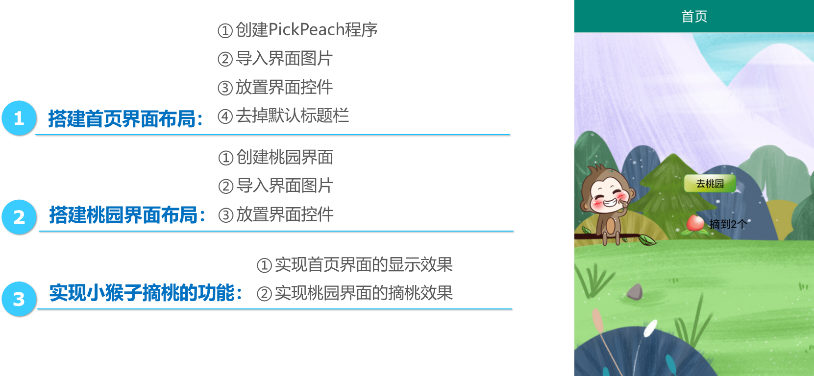

## 使用Fragment

> 不会考编程题，但是与Activity的区别和联系要知道

### 定义

Fragment（碎片）是一种嵌入在Activity中的UI片段，它可以用来描述Activity中的一部分布局。

### 生命周期

Fragment不能独立存在，必须嵌入到Activity中使用，所以Fragment生命周期直接受所在的Activity影响：

* 当在Activity中创建Fragment时，Fragment处于启动状态；
* 当Activity被暂停时，其中的所有Fragment也被暂停；
* 当Activity被销毁时，所有在该Activity中的Fragment也被销毁。
* 当一个Activity处于运行状态时，可以单独地对每一个Fragment进行操作，如添加或删除：
* 当添加时，Fragment处于启动状态。
* 当删除时，Fragment处于销毁状态。

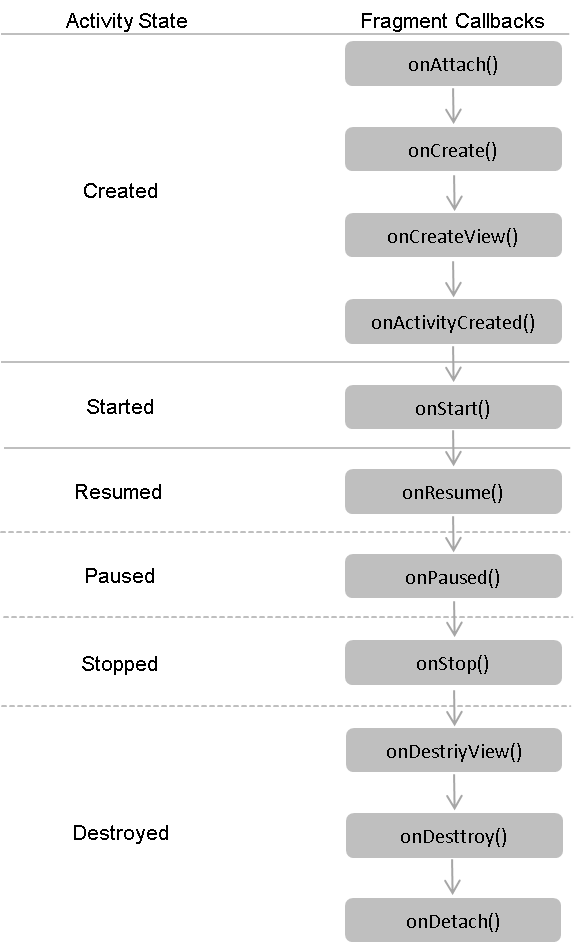

* onAttach()：当fragment和activity建立关联的时候调用
* onCreateView()：为fragment创建视图调用，在onCreate之后
* onActivityCreated()：确保与fragment相关联的activity一定已经创建完毕的时候调用 
* onDestroyView()：当与fragment关联的视图被移除的时候调用
* onDetach()：当fragment与activity解除关联时调用

### Fragment与Activity的区别和联系※

> chatGPT 3.5

| 特点     | Activity                                           | Fragment                                                     |
| -------- | -------------------------------------------------- | ------------------------------------------------------------ |
| 生命周期 | 有自己的生命周期                                   | 依附于Activity，生命周期受Activity的影响                     |
| 布局     | 可以单独存在                                       | 必须依附于Activity，不能单独存在                             |
| 交互     | 可以直接与用户交互                                 | 必须通过Activity来与用户交互                                 |
| 通信     | 可以通过Intent进行通信                             | 可以通过Activity进行通信，也可以通过接口回调等方式进行通信   |
| 关系     | 可以包含多个Fragment，Fragment可以嵌套其他Fragment | 必须依附于Activity，存在父子关系，可以嵌套其他Fragment       |
| 事件响应 | 可以响应用户的事件，如点击、滑动等                 | 可以响应Activity的事件，如点击、滑动等，也可以响应自己的事件 |
| 用途     | 用于实现应用程序的主要功能                         | 用于实现应用程序的复杂布局和交互逻辑                         |

# 第5章 数据存储

> 注意外部存储，SD卡的状态，不同的地方

## 文件存储

### 特点✦

openFileInput()和openFileOutput()读取设备上的文件，其读取方式与Java中I/O程序是完全一样的。

### 内部存储与外部存储对比

|                      | 内部存储                                                     | 外部存储                                               |
| -------------------- | ------------------------------------------------------------ | ------------------------------------------------------ |
| 存储位置             | 将数据以文件的形式存储到应用中                               | 将数据以文件的形式存储到外部设备上                     |
| 存储路径             | `data/data/<packagename>/`目录下                             | `mnt/sdcard/`目录下。                                  |
| 其他应用操作该文件时 | 需要设置权限                                                 | 不用设置权限，会被其它应用共享                         |
| 删除文件             | 当应用被卸载时，该文件也会被删除                             | 该文件可在本应用外删除，使用前需要确认外部设备是否可用 |
| 操作数据             | 通过openFileOutput()方法和openFileInput()方法获取FileOutputStream和FileInputStream操作对象 | 直接使用FileOutputStream和FileInputStream操作对象      |

### 将数据存入文件中

#### 内部存储

```java
//打开应用程序中对应的输出流，将数据存储到指定的文件中
FileOutputStream fos = openFileOutput(String name, //文件名
                                        int mode); //文件的操作模式
//打开应用程序对应的输入流，读取指定文件中的数据
FileInputStream fis = openFileInput(String name);
```

* MODE_PRIVATE：该文件只能被当前程序读写；
* MODE_APPEND：该文件的内容可以追加； 
* MODE_WORLD_READABLE：该文件的内容可以被其他程序读； 
* MODE_WORLD_WRITEABLE：该文件的内容可以被其他程序写。

```java
   String fileName = "data.txt";    //文件名称
   String content = "helloworld";  //保存数据
   FileOutputStream fos = null;
   try {
       fos = openFileOutput(fileName, MODE_PRIVATE);
       fos.write(content.getBytes());	 
   } catch (Exception e) {
       e.printStackTrace();
  }......
```

#### 外部存储

```java
    String state = Environment.getExternalStorageState(); // 获取外部设备状态
    if (state.equals(Environment.MEDIA_MOUNTED)) { // 判断外部设备状态是否可用
         File SDPath = Environment.getExternalStorageDirectory(); // 获取SD卡目录
         File file = new File(SDPath, "data.txt");
         String data = "HelloWorld";
         FileOutputStream fos = null;
         try {
              fos = new FileOutputStream(file);
              fos.write(data.getBytes());
         } ......
     }
```

### 从文件中读取数据

#### 内部存储

```java
    String content = "";
    FileInputStream fis = null;
    try {
        fis = openFileInput("data.txt"); // 获取文件输入流对象         
        byte[] buffer = new byte[fis.available()]; // 创建缓冲区并获取文件长度 
        fis.read(buffer);              	
        content = new String(buffer); // 将文件内容读取到buffer缓冲区
    } catch (Exception e) {
        e.printStackTrace();
    }
```

## SharedPreferences

### 定义/特点✦

SharedPreferences是Android平台上一个轻量级的存储类，用于持久化存储程序中一些少量数据，以XML格式将数据存储到设备。

### 数据存储位置

SharedPreferences中的Editor编辑器是通过key/value（键值对）的形式将数据保存在`data/data/<packagename>/shared_prefs`文件夹下XML文件中。

### 存储数据

```java
   SharedPreferences sp = getSharedPreferences("data",MODE_PRIVATE); //1. 获得 Sharedpreferences 对象
   SharedPreferences.Editor editor = sp.edit(); // 2. 获取编辑器对象
   // 3. 通过 Editor 接口的 putXxx 方法保存 key - value 对其中 Xxx 表示不同的数据类型
   editor.putString("name", "张三"); // 以key/value（键值对）的形式保存数据，value值只能是float、int、long、boolean、String、Set<String>类型数据
   editor.putInt("age", 8);                                              
   editor.commit(); // 提交数据
```

### 读取数据

```java
   SharedPreferences sp = getSharedPreferences("data",MODE_PRIVATE);	
   String data = sp.getString("name",""); // 获取用户名信息，第1个参数表示用户名数据的key值，第2个参数表示缺省值
```

### 删除数据

```java
   editor.remove("name"); // 删除key值为name的数据
   editor.clear(); // 删除所有数据
```

### 实战演练-保存QQ账号与密码


## SQLite数据库

### 定义/特点✦

* SQLite是Android自带的一个**轻量级**的数据库，它运算速度快，占用资源少，支持基本SQL语法。
* SQLite数据库可以存储应用程序中的**大量数据**，并对数据进行管理和维护。
* SQLite**没有服务器进程**，它通过文件保存数据，该文件是**跨平台**的，可以放在其他平台中使用。

### 创建SQLite数据库★

```java
     //SQLiteOpenHelper用于创建和更新数据库
     public class MyHelper extends SQLiteOpenHelper {
           public MyHelper(Context context) {
                 super(context, //表示上下文
                       "itcast.db", //数据库名称
                       null, //游标工厂，此处设为null
                       2); //数据库版本号
            //如果构造函数中的数据库版本号大于当前数据库的版本号，onUpgrade方法将被调用
            }
            public void onCreate(SQLiteDatabase db) { // 数据库第一次被创建时调用，用于初始化表结构
                  db.execSQL("CREATE TABLE information(_id INTEGER PRIMARY KEY AUTOINCREMENT, name VARCHAR(20), price INTEGER)");
            }
         // 当数据库的版本号增加时调用
           public void onUpgrade(SQLiteDatabase db, int oldVersion, int newVersion) {
            }
    }
```

### 添加数据

```java
     public void insert(String name,String price) {
           MyHelper helper = new MyHelper(MainActivity.this);
           // SQLiteDatabse用于操作数据库的增删改查
           SQLiteDatabase db = helper.getWritableDatabase(); // 获取可读写SQLiteDatabse对象 
           ContentValues values = new ContentValues(); 	
         // 将数据添加到ContentValues对象中
           values.put("name", name); 
           values.put("price", price);
         // 调用insert()方法将数据添加到数据库中
           long id = db.insert("information", //数据表名称
                               null, //如果ContentValues对象为空（要插入一个空行），且参数`nullColumnHack`非空，则参数代表新的一行中哪一列的值置为NULL，并且其它列的值为""
                               values); 
           db.close(); // 关闭数据库
    }
```

### 删除数据

```java
     public int delete(long id){	
          SQLiteDatabase db = helper.getWritableDatabase();
          int number = db.delete("information", //数据表名称
                                 "_id=?", new String[]{id+""}); // 调用delete()方法删除数据库中的数据
          db.close();
          return number;
    }
```

### 修改数据

```java
  public int update(String name, String price) {	
        SQLiteDatabase db = helper.getWritableDatabase();
        ContentValues values = new ContentValues(); 
         values.put("price", price); // 将修改的数据添加到values对象中
         int number = db.update("information", values, "name =?", new String[]{name}); // 调用update()方法修改数据
         db.close();
         return number;
  }
```

### 查询数据

```java
  public void find(int id){
        MyHelper helper = new MyHelper(MainActivity.this);
        SQLiteDatabase db = helper.getReadableDatabase();
        Cursor cursor = db.query("information", null, "_id=?", new String[]{id+""}, null, null, null); // 调用query()方法查询数据库中的数据，返回一个行数集合Cursor（游标）
      // 判断查询到的数据总条数不是0时
        if (cursor.getCount() != 0){   //cursor用于遍历查询结果
            // 移动游标指向下一行数据
             while (cursor.moveToNext()){
             // 获取数据
             String _id = cursor.getString(cursor.getColumnIndex("_id"));
             String name = cursor.getString(cursor.getColumnIndex("name"));
             String price = cursor.getString(cursor.getColumnIndex("price"));
         }
         cursor.close();
         db.close();
  }
```

### 数据库事务的4个基本要素（ACID）

* 原子性：表示事务是一个不可再分割的工作单位，事务中的操作要么全部成功，要么全部失败回滚。
* 一致性：表示事务开始之前和结束之后，数据库的完整性没有被破坏。也就是说数据库事务不能破坏关系数据的完整性以及业务逻辑上的一致性。
* 隔离性：表示并发的事务是相互隔离的，也就是一个事务内部的操作都必须封锁起来，不会被其他事务影响到。
* 持久性：表示事务一旦提交后，该事务对数据做的更改便持久保存在数据库中，并不会被回滚，即使出现了断电等事故，也不会影响数据库中的数据。

### SQlite与其它数据库的区别※

> chatGPT 4

| 特点       | SQLite                                       | 其他数据库（如MySQL、PostgreSQL）    |
| ---------- | -------------------------------------------- | ------------------------------------ |
| 体积       | 轻量级，占用资源较少                         | 通常较大，占用资源较多               |
| 安装与配置 | 无需安装，嵌入式数据库                       | 需要安装和配置                       |
| 存储方式   | 以文件形式存储在本地                         | 通常以服务器形式存储，需要连接服务器 |
| 并发性能   | 适用于低并发场景，写操作会锁定整个数据库文件 | 适用于高并发场景，支持多用户并发访问 |
| 适用场景   | 适用于移动设备、桌面应用等轻量级应用         | 适用于服务器端、企业级应用等大型应用 |
| 事务支持   | 支持事务，但性能较低                         | 支持事务，性能较高                   |
| 数据类型   | 数据类型较少，支持动态类型                   | 数据类型丰富，支持静态类型           |
| SQL功能    | 支持的SQL功能较少                            | 支持的SQL功能较丰富                  |
| 网络访问   | 不支持网络访问                               | 支持网络访问，可以远程连接           |

### 实战演练-绿豆通讯录


## ContentProvider

应用程序之间的数据交换，可以将自己的数据共享给其他应用程序使用。

## 网络存储✦

需要与Android网络数据包打交道，将数据存储到服务器上，通过网络提供的存储空间来存储/获取数据信息。

# 第6章 内容提供者和内容观察者

## 内容提供者

### 定义/作用★


内容提供者（ContentProvider）是Android系统四大组件之一，它是不同应用程序之间进行数据共享的标准API，通过ContentResolver类可以访问ContentProvider中共享的数据。

### 原理

假设B程序需要操作A程序数据库中的数据，一般需要A程序使用ContentProvider暴露数据，才能被其他程序操作。B程序通过ContentResolver操作A程序暴露出来的数据，而A程序会将操作结果返回给ContentResolver，然后ContentResolver再将操作结果返回给B程序。

### 数据模型

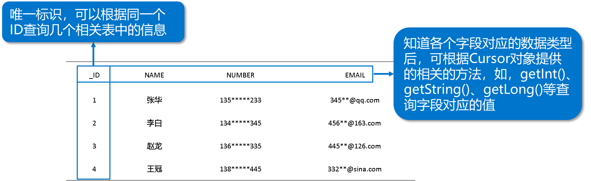

ContentProvider 使用基于数据库模型的简单表格来提供需要共享的数据，在该表格中，每一行表示一条记录，而每一列代表特定类型和含义的数据，并且其中每一条数据记录都包含一个名为“_ID”的字段类标识每条数据。

### Uri

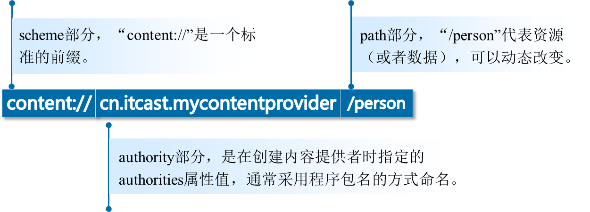

#### 定义

ContentResolver提供一系列增删改查的方法对数据进行操作，并且这些方法以Uri的形式对外提供数据。Uri为内容提供者中的数据建立了唯一标识符。

#### 组成

scheme、authorities、path

### 创建内容提供者

1. 选中程序包名右击选择【New】→【Other】→【Content Provider】选项
2. 输入内容提供者的Class Name（类名称）和URI Authorities（唯一标识，通常使用包名）
3. 点击“Finish”按钮完成创建

内容提供者创建完成后，Android Studio会自动在AndroidManifest.xml中对内容提供者进行注册。

```xml
    <application ......>
            ......	
           <provider
                 android:name=".MyContentProvider"
                 android:authorities="cn.itcast.mycontentprovider"
                 android:enabled="true"
                 android:exported="true" >
           </provider>
   </application>
```

MyContentProvider.java文件

```java
  public Uri insert(Uri uri, ContentValues values)  // 外部进程向其添加数据
   public int delete(Uri uri, String selection, String[] selectionArgs)// 外部进程 删除数据
   public int update(Uri uri, ContentValues values, String selection, String[] selectionArgs)  // 外部进程更新 ContentProvider 中的数据
   public Cursor query(Uri uri, String[] projection, String selection, String[] selectionArgs,  String sortOrder)　  // 外部应用 获取 ContentProvider 中的数据
   // 注：上述4个方法由外部进程回调，并运行在ContentProvider进程的Binder线程池中
 public boolean onCreate() //创建时调用
 public String getType(Uri uri)
// 得到数据类型，即返回当前 Url 所代表数据的MIME类型， MIME作用：指定某个扩展名的文件用某种应用程序来打开
```

### 访问其他应用程序

1. 通过parse()方法解析Uri

   ```java
       Uri uri = Uri.parse("content://cn.itcast.mycontentprovider/person");
   ```

2. 通过query()方法查询数据

   ```java
       //获取ContentResolver对象
      ContentResolver resolver = context.getContentResolver();
      Cursor cursor = resolver.query(Uri uri, String[] projection, String selection,
                                                                      String[] selectionArgs, String sortOrder);
   ```

3. 通过while()循环语句遍历查询到的数据

   ```java
       while (cursor.moveToNext()) {
            String address = cursor.getString(0); 
            long date = cursor.getLong(1);
            int type = cursor.getInt(2);
       }
       cursor.close(); //关闭cursor
   ```

## 内容观察者

### 定义/作用★

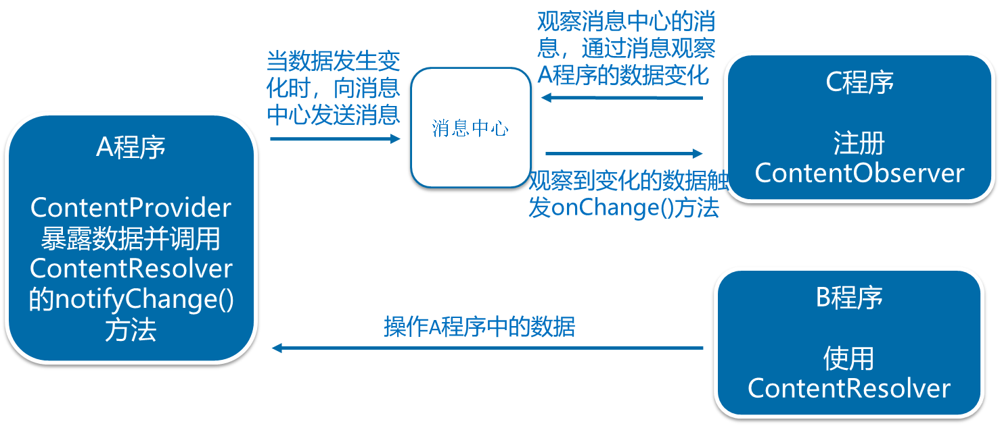

内容观察者（ContentObserver）用于观察指定Uri所代表的数据的变化

### 原理

使用ContentObserver观察A程序的数据时，首先要在A程序的ContentProvider中调用ContentResolver的notifyChange()方法。调用此方法后，当B程序操作A程序中的数据时，A程序会向“消息中心”发送数据变化的消息，此时C程序会观察到“消息中心”的数据有变化，会触发ContentObserver的onChange()方法。

### 使用方法

要使用ContentObserver观察数据变化，就必须在ContentProvider的delete()、insert()、update()方法中调用ContentResolver的notifyChange()方法。

# 第7章 广播机制

## 作用

便于发送和接收系统级别的消息通知

## 概念

Android中的广播(Broadcast)机制用于**进程/线程间通信**，该机制使用了**观察者模式**，观察者模式是一种软件设计模式，该模式是基于消息的发布/订阅事件模型，该模型中的消息发布者是广播机制中的**广播发送者**，消息订阅者是广播机制中的**广播接收者**。

## 实现流程✦

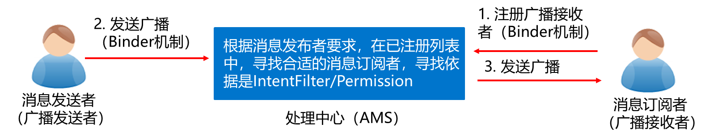

1. 广播接收者通过Binder机制在AMS(Activity Manager Service)中进行注册。
2. 广播发送者通过Binder机制向AMS发送广播。
3. AMS查找符合相应条件（IntentFilter/Permission）的广播接收者，将广播发送到相应的消息循环队列中。
4. 执行消息循环时获取到发送的广播，然后回调广播接收者中的onReceive()方法并在该方法中进行相关处理。

## 广播接收者

### 注册方式

#### 动态注册

在Activity中通过代码注册广播接收者

```java
    private MyReceiver receiver;     
    protected void onCreate(Bundle savedInstanceState) {
            super.onCreate(savedInstanceState); 
            receiver = receiver = new MyBroadcastReceiver(); //实例化广播接收者
            //实例化过滤器并设置要过滤的广播
            String action = "android.provider.Telephony.SMS_RECEIVED";
            IntentFilter intentFilter = new IntentFilter();
            intentFilter.addAction(action);
            registerReceiver(receiver,intentFilter); //注册广播
     }
     protected void onDestroy() {
            super.onDestroy();
            unregisterReceiver(receiver); //当Activity销毁时，取消注册
     }
```

动态注册的广播接收者是否被注销依赖于注册广播的组件，当组件销毁时，广播接收者也随之被注销。

#### 静态注册

在清单文件中配置广播接收者

```xml
  <?xml version="1.0" encoding="utf-8"?>
  <manifest ……….  >
          <application ……… > 
               <receiver
                      android:name=".MyReceiver"
                         <!-- 系统实例化 -->
                      android:enabled="true" 
              <!-- 接收当前程序之外的广播 -->
                      android:exported="true" > 
               </receiver> 
         </application>
  </manifest>
```

> 注意：在Android 8.0之后，使用静态注册的广播接收者将无法接收到广播。因此无需在清单文件中注册。

## 广播的类型

### 对比★

1. 发送广播时，使用的方法不同。

   1. 有序广播使用sendOrderedBroadcast()发送广播
   2. 无序广播使用sendBroadcast()方法发送广播。

2. 广播接收者执行的顺序

   1. 有序广播的接收者是顺序执行的。

      有序广播按照广播接收者声明的优先级别被依次接收。当在高级别的广播接收者逻辑执行完毕之后，广播才会继续传递。当优先级相同时，先注册的广播接受者优先执行。

   2. 无序广播是完全异步执行的。

      当发送无序广播时，所有监听这个广播的广播接收者都会接收到此广播消息，但接收和执行的顺序不确定。

3. 拦截广播

   1. 有序广播的接收者可拦截广播。如果优先级较高的广播接收者将广播终止，那么广播将不再向后传递。
   2. 无序广播不能被拦截。

4. 效率

   有序广播的效率比无序广播低。

### 无序广播

#### 定义

完全异步执行，发送广播时所有监听这个广播的广播接收者都会接收到此消息，但接收的顺序不确定。

#### 代码

```java
sendBroadcast(Intent intent, //广播的意图对象
            String receiverPermission); //指定广播接收者的权限（与此权限匹配的广播接收者才能接收到相应的广播）
```

### 有序广播

#### 定义

按照接收者的优先级接收，同一时刻只有一个广播接收者能接收消息，在此广播接收者中逻辑执行完毕后，才会继续传递。

#### 代码

```java
sendOrderedBroadcast(Intent intent, //广播的意图对象
            String receiverPermission); //指定广播接收者的权限（与此权限匹配的广播接收者才能接收到相应的广播）
```

#### 有序广播拦截实现

BroadOrderActivity

```java
public class BroadOrderActivity extends AppCompatActivity implements View.OnClickListener {

    public static final String ORDER_ACTION = "com.dongnaoedu.chapter09.order";
    private OrderAReceiver orderAReceiver;
    private OrderBReceiver orderBReceiver;

    @Override
    protected void onCreate(Bundle savedInstanceState) {
        super.onCreate(savedInstanceState);
        setContentView(R.layout.activity_broad_order);
        findViewById(R.id.btn_send_order).setOnClickListener(this);
    }

    @Override
    public void onClick(View v) {
        // 创建一个指定动作的意图
        Intent intent = new Intent(ORDER_ACTION);
        // 发送有序广播
        sendOrderedBroadcast(intent, null);
    }

    @Override
    protected void onStart() {
        super.onStart();
        // 多个接收器处理有序广播的顺序规则为：
        // 1、优先级越大的接收器，越早收到有序广播；
        // 2、优先级相同的时候，越早注册的接收器越早收到有序广播
        orderAReceiver = new OrderAReceiver();
        IntentFilter filterA = new IntentFilter(ORDER_ACTION);
        filterA.setPriority(8);
        registerReceiver(orderAReceiver, filterA);

        orderBReceiver = new OrderBReceiver();
        IntentFilter filterB = new IntentFilter(ORDER_ACTION);
        filterB.setPriority(10);
        registerReceiver(orderBReceiver, filterB);
    }

    @Override
    protected void onStop() {
        super.onStop();
        unregisterReceiver(orderAReceiver);
        unregisterReceiver(orderBReceiver);
    }
}
```

OrderAReceiver

```java
public class OrderAReceiver extends BroadcastReceiver {

    @Override
    public void onReceive(Context context, Intent intent) {
        if (intent != null && intent.getAction().equals(BroadOrderActivity.ORDER_ACTION)){
            Log.d("ning", "接收器A收到一个有序广播");
        }
    }
}
```

OrderBReceiver

```java
public class OrderBReceiver extends BroadcastReceiver {

    @Override
    public void onReceive(Context context, Intent intent) {
        if (intent != null && intent.getAction().equals(BroadOrderActivity.ORDER_ACTION)){
            Log.d("ning", "接收器B收到一个有序广播");
            abortBroadcast(); // 中断广播，此时后面的接收器OrderAReceiver无法收到该广播
        }
    }
}
```

# 第8章 服务

## 概念

* Service（服务）是Android四大组件之一，能够在**后台长时间执行**操作并且**不提供用户界面**的应用程序组件。
* Service可以与其他组件进行交互，一般是由Activity启动，但是并不依赖于Activity。
* 当Activity的生命周期结束时，Service仍然会继续运行，直到自己的生命周期结束为止。
* 具有较长的时间运行特性。

> 在主线程运行

## 应用场景

### 后台运行

在后台长时间进行操作而不用提供界面信息，只有当系统必须要回收内存资源时，才会被销毁

### 跨进程访问

当Service被其他应用组件启动时，即使用户切换到其他应用，服务仍将在后台继续运行。

## 与Activity的区别★

> 稍微改一改可以作为Service的特点进行回答

* 进程启动了Service后，进程的**优先级变高**，一般情况系统不会kill该进程，而Activity不具备这样的特性
* Service和Activity的生命周期不一样，Service处在哪个生命周期是**由程序控制**的，而Activity处在哪个生命周期是**由系统控制**的，Service不能自己启动，而且不与用户交互 
* Service是一种应用程序组件，可以在**后台**执行**长时间运行**的操作，并且不提供用户界面，而Activity不可以
* Service可以通过Binder实现**跨进程调用**，而Activity不处理跨进程调用的工作
* Service不仅可以**给Activity建立双向连接**，提供数据和功能支持，也**可以单向接受Intent的请求**，进行数据的分析处理和功能调度

## 启动方式✦

### 通过startService()方法启动

当通过startService()方法启动服务时，需要自身调用stopSelf()方法或者其他组件调用stopService()方法时服务才能停止。

### 通过bindService()方法启动

当通过bindService()方法启动服务时，需要调用onUnbind()方法解除绑定之后服务才会被销毁。

> 使用不同的方法启动服务，其生命周期也是不同的。

###生命周期✦

使用不同的方式启动服务，其生命周期会不同。

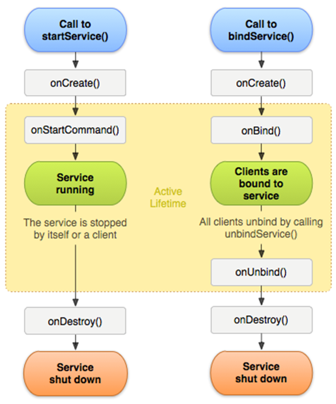

* 开启服务的方法分别为startService()、bindService()。
  * 当通过startService()方法启动服务时，执行的生命周期方法依次为onCreate()、onStartCommand()、onDestroy()。
  * 当通过bindService()方法启动服务时，执行的生命周期方法依次为onCreate()、onBind()、onUnbind()、onDestroy()。

* 生命周期方法的具体含义如下：
  * onCreate ():第一次创建服务时执行的方法。
  * onStartCommand():调用startService()方法启动服务时执行的方法。
  * onBind():调用bindService()方法启动服务时执行的方法。
  * onUnbind():调用unBindService()方法断开服务绑定时执行的方法。
  * onDestory():服务被销毁时执行的方法。

## 实战演练-仿网易音乐播放器

> 匿名内部类


# 第9章 网络编程

> 主要是9.1节

## 使用HTTP访问网络

### 使用HttpURLConnection访问网络

#### 步骤✦

1. 创建URL对象。
2. 调用URL对象的openConnection()方法获取HttpURLConnection对象。
3. 调用setRequestMethod()方法设置http请求的方式。
4. 通过setConnectTimeout()方法设置连接的超时时间。
5. 调用getInputStream()方法获取服务器返回的输入流。
6. 最后调用disconnect()方法关闭http连接。

```java
    URL url = new URL("http://www.itcast.cn"); //在URL的构造方法中传入要访问资源的路径    
    HttpURLConnection conn = (HttpURLConnection)url.openConnection(); //创建HttpURLConnection对象
// 设置请求方式
    conn.setRequestMethod("GET");                   
    conn.setConnectTimeout(5000); //设置超时时间                  
    InputStream is = conn.getInputStream(); //获取服务器返回的输入流
    conn.disconnect(); //关闭HTTP连接                               
```

> 使用HttpURLConnection对象访问网络时，需要设置超时时间，防止连接被阻塞时无响应，影响用户体验。

#### GET方式提交数据

```java
    String path = "http://192.168.1.100:8080/web/LoginServlet?username=" + URLEncoder.encode("zhangsan") +"&password="+ URLEncoder.encode("123"); //将用户名和密码拼在指定资源路径后面，并对用户名和密码进行编码
    URL url =  new  URL(path);                      
    HttpURLConnection  conn  =  (HttpURLConnection)url.openConnection();  
    conn.setRequestMethod("GET");                  
    conn.setConnectTimeout(5000);                  
    int responseCode = conn.getResponseCode(); //获取到状态码 
    if(responseCode == 200){                        
        //状态码为200，表示访问成功
        //获取返回内容的输入流    
        InputStream is = conn.getInputStream(); 
    }
```

#### POST方式提交数据

```java
    URL url = new URL("http://192.168.1.100:8080/web/LoginServlet");
    HttpURLConnection conn = (HttpURLConnection) url.openConnection();
    conn.setConnectTimeout(5000);                
    conn.setRequestMethod("POST");               
    String data = "username=" + URLEncoder.encode("zhangsan") + "&password=" + URLEncoder.encode("123"); //准备数据并给参数进行编码
    conn.setRequestProperty("Content-Type", "application/x-www-form-urlencoded"); 
    conn.setRequestProperty("Content-Length", data.length() + ""); //设置请求头数据提交方式以及提交数据的长度，这里是以form表单的方式提交 

//以流的形式将数据写到服务器上
    conn.setDoOutput(true); 
    OutputStream os = conn.getOutputStream(); 
    os.write(data.getBytes()); 

    int code = conn.getResponseCode(); 
    if (code == 200) {
        InputStream is = conn.getInputStream(); 
    }
```

# 补充

## 传感器

> 有哪些，怎么调用

* 可参考
  * https://blog.csdn.net/qq_21154101/article/details/99766640
  * https://blog.csdn.net/tracydragonlxy/article/details/128410934

## 清单文件AndroidManifest.xml的作用

> chatGPT 3.5

1. 软件包名称和应用程序ID：应用的通用唯一应用ID，其最终值必须在全球范围内唯一，因为这是在系统和Google Play中标识应用程序的唯一保证方法。
2. 声明应用程序的组件：在AndroidManifest.xml中，您可以声明应用程序的各种组件，如活动（Activity）、服务（Service）、广播接收器（Broadcast Receiver）和内容提供器（Content Provider）。这些声明告诉Android系统应用程序的组织结构和功能。
3. 定义应用程序的权限：您可以在AndroidManifest.xml文件中定义应用程序需要的权限。权限定义了应用程序可以访问的系统资源和功能，如访问互联网、读取联系人信息等。通过权限的定义，系统可以确保应用程序在访问敏感数据或执行敏感操作时得到用户的授权。
4. 设置应用程序的元数据：AndroidManifest.xml文件允许您为应用程序和其组件设置元数据。元数据是关于应用程序的附加信息，可以用于配置和控制应用程序的行为。
5. 声明应用程序的入口点：通过指定一个或多个活动（Activity）作为应用程序的入口点，AndroidManifest.xml文件定义了当用户启动应用程序时所显示的第一个界面。
6. 声明应用程序的配置信息：AndroidManifest.xml文件还允许您声明应用程序的配置信息，如支持的屏幕方向、最小和目标SDK版本等。这些配置信息对于应用程序的运行和兼容性非常重要

## [XmlPullParser](https://www.apiref.com/android-zh/org/xmlpull/v1/XmlPullParser.html)※

XmlPullParser是Android平台上一个轻量级的XML解析器，它提供了一种基于事件的解析方式，可以高效地解析XML文件。XmlPullParser有很多常用的属性，如下所示

```java
int START_DOCUMENT = 0;  开始解析文档
int END_DOCUMENT = 1;    内容结束
int START_TAG = 2;       读取标签
int END_TAG = 3;         标签读取结束
int TEXT = 4;            读取文本
```

## AlertDialog对话框

### 创建流程

1. 调用AlertDialog的静态内部类Builder创建AlertDialog.Builder的对象。
2. 调用AlertDialog.Builder的setTitle()和setIcon()方法分别设置AlertDialog对话框的标题名称和图标。
3. 调用AlertDialog.Builder的setMessage()、setSingleChoiceItems()或者setMultiChoiceItems()方法设置AlertDialog对话框的内容为简单文本、单选列表或者为多选列表。
4. 调用AlertDialog.Builder的setPositiveButton()和setNegativeButton()方法设置AlertDialog对话框的确定和取消按钮。
5. 调用AlertDialog.Builder的create()方法创建AlertDialog对象。
6. 调用AlertDialog对象的show()方法显示该对话框。
7. 调用AlertDialog对象的dismiss()方法取消该对话框。

### 在Activity中设置

```java
/**
 * 提示对话框
 */
public void tipDialog() {
    AlertDialog.Builder builder = new AlertDialog.Builder(MainActivity.this);
    builder.setTitle("提示：");
    builder.setMessage("这是一个普通对话框，");
    builder.setIcon(R.mipmap.ic_launcher);
    builder.setCancelable(true);            //点击对话框以外的区域是否让对话框消失
 
    //设置正面按钮
    builder.setPositiveButton("确定", new DialogInterface.OnClickListener() {
        @Override
        public void onClick(DialogInterface dialog, int which) {
            Toast.makeText(MainActivity.this, "你点击了确定", Toast.LENGTH_SHORT).show();
            dialog.dismiss();
        }
    });
    //设置反面按钮
    builder.setNegativeButton("取消", new DialogInterface.OnClickListener() {
        @Override
        public void onClick(DialogInterface dialog, int which) {
            Toast.makeText(MainActivity.this, "你点击了取消", Toast.LENGTH_SHORT).show();
            dialog.dismiss();
        }
    });
    //设置中立按钮
    builder.setNeutralButton("保密", new DialogInterface.OnClickListener() {
        @Override
        public void onClick(DialogInterface dialog, int which) {
            Toast.makeText(MainActivity.this, "你选择了中立", Toast.LENGTH_SHORT).show();
            dialog.dismiss();
        }
    });
 
 
    AlertDialog dialog = builder.create();      //创建AlertDialog对象
    //对话框显示的监听事件
    dialog.setOnShowListener(new DialogInterface.OnShowListener() {
        @Override
        public void onShow(DialogInterface dialog) {
            Log.e(TAG, "对话框显示了");
        }
    });
    //对话框消失的监听事件
    dialog.setOnCancelListener(new DialogInterface.OnCancelListener() {
        @Override
        public void onCancel(DialogInterface dialog) {
            Log.e(TAG, "对话框消失了");
        }
    });
    dialog.show();                              //显示对话框
}
```

# 课后习题

## 选择题

> 仅摘录部分易错的习题

1. 6-5 下列关于ContentProvider的描述，错误的是（D）

   A．ContentProvider 是一个抽象类，只有继承后才能使用

   B．ContentProvider只有在AndroidManifest.xml文件中注册后才能运行

   C．ContentProvider为其他应用程序提供了统一的访问数据库的方式

   D．以上说法都不对

   > ContentProvider是Android四大组件之一，它为其他应用程序提供了统一的访问数据库的方式。ContentProvider不是一个抽象类，而是一个抽象类的子类，可以直接使用，可以使用系统提供的 ContentResolver 对象来访问 ContentProvider 中的数据。ContentProvider不仅可以访问数据库，还可以访问文件、网络等资源。

2. 7-2  广播机制作为Android组件间的通信方式，使用的场景有哪些（ABCD）（多选）

   A、在同一个APP内部的同一组件内进行消息通信

   B、不同APP的组件之间进行消息通信

   C、在同一个APP内部的不同组件之间进行消息通信（单个进程）

   D、在同一个APP具有多个进程的不同组件之间进行消息通信

3. 9-2 Android中的HttpURLConnection中的输入/输出流操作被统一封装成了（ABD）。（多选）

   A．HttpGet  B．HttpPost  C．HttpRequest  D．HttpResponse

## 简答题

> 仅摘录不在本文档正文提到的，并且有一定考试概率的

1. 1-2 简述Android源代码的编译过程

   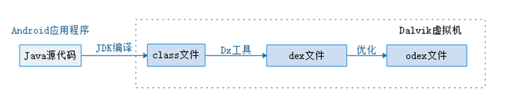

   Java源文件经过JDK编译器编译为class文件后，Dalvik虚拟机中的Dx工具会将部分class文件转换成dex文件，dex文件还会在Dalvik虚拟机中进一步优化成odex文件。

2. 4-3 简述AlertDialog对话框的创建过程

   [详见](#创建流程)

3. 8-1 简述Service的两种启动方式的区别✦

   

   Service的启动方式分别可以调用startService()、bindService()方法，这两个启动方式的区别如下所示：

   1. 生命周期
      1. startService():使用该方法开启Service时，执行的生命周期方法依次为onCreate()、onStartCommand()、onDestroy()。
      2. bindService()：使用该方法开启Service时，执行的生命周期方法依次为：onCreate()、onBind()、onUnbind()、onDestroy()。
   2. 停止服务的方法
      1. startService():调用stopSelf()、stopService()方法停止服务。
      2. bindService():调用unbindService()方法停止服务。
   3. 组件的关联
      1. startService():当一个组件通过此方法开启服务时，服务与开启该组件没有关联，即使开启服务的组件被销毁，服务依旧运行。
      2. bindService():当一个组件通过此方法开启服务时，服务会与该组件绑定，组件一旦被销毁，该服务也会被销毁。

# 论述题

> 收集历年试题中最后一题，使用chatGPT 3.5撰写答案

## 通过安卓课程学习对该平台有何认识？

可以考虑直接答安卓定义、特点和体系结构

## 你认为智能终端开发的行业前景如何？

安卓开发有着巨大的发展潜力，安卓是全球最主流的移动操作系统之一，市场份额庞大。随着智能设备的普及，对安卓应用的需求不断增长。安卓平台的开放性和灵活性给开发者提供了广阔的创作空间。随着技术的发展，如人工智能和增强现实，安卓开发将迎来新的机遇和挑战。

## 如何发展具有中国特色社会主义的智能手机操作系统？

1. 安全与隐私保护：智能手机操作系统应加强对用户数据的保护，确保用户信息不被滥用和泄露。
2. 本土化服务与内容：操作系统应提供适应中国市场的本土化服务和内容，满足中国用户的需求和习惯。
3. 政府支持与合作：政府可以提供支持和合作，推动本土操作系统的发展，包括提供政策支持、资金支持和市场准入等方面的帮助。
4. 开放与合作：与国内外的技术公司和开发者进行合作，共享资源和经验，加快智能手机操作系统的创新和发展。

## 安卓操作系统与其它的智能手机操作系统（如IOS、Windows Phone等）相比有何优缺点？

| 比较指标   | 安卓操作系统                                             | iOS                                                          | Windows Phone                          |
| ---------- | -------------------------------------------------------- | ------------------------------------------------------------ | -------------------------------------- |
| 开发模式   | 开放源代码，可自定义和修改系统                           | 封闭系统，限制用户的自定义和修改能力                         | 封闭系统，限制用户的自定义和修改能力   |
| 安全性     | 容易受到恶意软件和安全漏洞的攻击                         | 提供更高的安全性，封闭性和应用审核严格                       | 受到攻击的可能性较低，市场份额较小     |
| 应用市场   | 拥有广泛的应用生态系统                                   | 拥有丰富的应用商店和高质量的应用生态系统                     | 应用生态系统相对较小，应用选择较少     |
| 设备选择   | 可在多种设备上运行，提供更大的选择范围                   | 只能在苹果设备上运行，设备选择受限                           | 设备选择较少，市场份额较小             |
| 定制能力   | 允许用户对界面、主题、图标等进行高度个性化定制           | 个性化定制能力相对较低                                       | 个性化定制能力相对较低                 |
| 价格范围   | 价格范围广泛，从低端到高端都有不同选择                   | 设备价格较高，倾向于中高端市场                               | 设备价格范围适中                       |
| 片段化     | 不同设备和制造商可能使用不同的操作系统版本和用户界面     | 系统更新更加统一和及时，片段化问题较少                       | 片段化问题相对较少                     |
| 用户体验   | 不同设备和用户界面可能导致一致性和用户体验的差异         | 注重一致性，提供统一的用户体验                               | 在用户体验方面做了一些独特的设计       |
| 更新速度   | 更新速度取决于设备制造商和运营商，可能存在更新滞后的情况 | 由苹果控制，可在所有兼容设备上及时推送更新                   | 更新由微软控制，但速度较慢             |
| 开发者支持 | 提供广泛的开发者支持和文档资源，灵活开发应用             | 提供全面的开发者支持和详尽的文档资源，有助于构建高质量的应用 | 开发者支持相对较少，开发者资源相对较少 |
