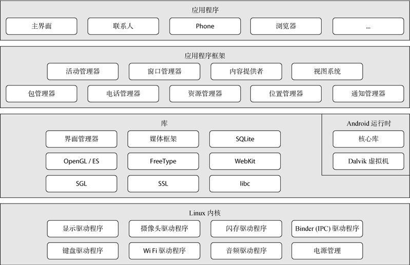

# 前言

1. ★：录音中提到的
2. 致谢：hwl
3. 重点来源：7-8班 PPT和录音
4. 内容来源：PPT
5. 知识点大多很抽象，需要联系实际代码来理解
6. 多做1-9章课后习题，编程题可以不做
7. [获取最新版本](https://github.com/3210448723/SoftwareTestCourse)
8. [可参考](https://blog.csdn.net/yuhaowu0422/article/details/121601276)

# 题型

1. 选择题（10小题×2分，共20分，不写多选为单选）：分散在各个章节，大部分单选
2. 判断题（10小题×1分，共10分）
3. 简答题（5小题×6分，共30分）：往年试题具有较大参考价值
4. 程序代码填空题（14空×2分，共28分）：主要涉及2-4章的内容
5. 论述题（12分）

# 第1章 安卓基础入门

## Android

###  定义★

* 安卓（Android）是一种基于Linux内核（不包含GNU组件）的自由及开放源代码的操作系统。
* Android是Google公司基于Linux平台开发的手机及平板电脑的操作系统，它自问世以来，受到了前所未有的关注，并迅速成为移动平台最受欢迎的操作系统之一。

### 特点


### 体系结构★



### 资源的管理与使用

> 了解一下

#### 图片资源

##### 扩展名

.png、.jpg、.gif、.9.png等

##### 分类

###### 应用图标资源

存放在mipmap文件夹中

###### 界面中使用的图片资源

存放在drawable文件夹中

##### 屏幕密度匹配规则

| 密度范围值 | mipmap文件夹  | drawable文件夹  |
| ---------- | ------------- | --------------- |
| 120~160dpi | mipmap_mdpi   | mipmap_mdpi     |
| 160~240dpi | mipmap_hdpi   | drawable_hdpi   |
| 240~320dpi | mipmap_xdpi   | drawable_xdpi   |
| 320~480dpi | mipmap_xxdpi  | drawable_xxdpi  |
| 480~640dpi | mipmap_xxxdpi | drawable_xxxdpi |

##### 调用方式

###### 通过Java代码调用图片资源

```java
   //调用mipmap文件夹中资源文件
   getResources().getDrawable(R.mipmap.ic_launcher);
   //调用以drawable开头的文件夹中的资源文件
   getResources().getDrawable(R.drawable.icon); 
```

###### 在XML布局文件中调用图片资源

```xml
   @mipmap/ic_launcher   //调用mipmap文件夹中的资源文件
   @drawable/icon        //调用以drawable开头的文件夹中的资源文件
```

#### 主题和样式资源

##### 主题

###### 定义

包含一种或多种格式化属性的集合，在程序中调用主题资源可改变窗体的样式。

###### 定义位置

`res/values`目录下的`styles.xml`文件中

```xml
  <!-- name:用于指定主题名称 parent:用于指定继承的父主题 -->
  <style name="AppTheme" parent="Theme.AppCompat.Light.DarkActionBar">
        <item name="colorPrimary">@color/colorPrimary</item>
        <item name="colorPrimaryDark">@color/colorPrimaryDark</item>
        <item name="colorAccent">@color/colorAccent</item>
  </style>
```

###### 调用主题

1. 在AndroidManifest.xml文件中设置主题

   ```xml
     <application
                  ...
                  android:theme ="@style/AppTheme">
   ```

2. 方法二：在Java代码中设置主题

   ```java
     setTheme(R.style.AppTheme);
   ```

##### 样式

###### 定义

设置View的宽度、高度和背景颜色等信息。

###### 定义位置

`res/values`目录下的`styles.xml`文件中

```xml
<style name="btnStyle">
	<item name="android:layout_width">wrap_content</item>
    <item name="android:layout_height">match_parent</item>
    <item name="android:textSize">20sp</item>
</style>
```

###### 调用样式

在XML布局文件中引用样式

```xml
<Button
	style="@style/btnStyle"
        android:text="+"/>
```

#### 布局资源

##### 定义

通常用于搭建程序中的各个界面。

##### 存放位置

`res/layout`文件夹中

##### 调用方式

###### 通过Java代码调用布局资源文件

```java
  //在Activity的onCreate()方法中调用activity_main.xml布局文件
  setContentView(R.layout.activity_main);
```

###### 在XML布局文件中调用布局资源文件

```xml
  //在XML布局文件中调用activity_main.xml布局文件
  <include layout="@layout/activity_main"/>
```

#### 字符串资源

##### 定义

用于显示界面上的文本信息。

##### 定义位置

res/values目录下的strings.xml文件中

```xml
 <resources>
      <string name="app_name">字符串</string>
 </resources>
```

##### 通过Java代码调用字符串资源

```java
   getResources().getString(R.string.app_name); 
```

##### 在XML布局文件中调用字符串资源

```xml
   @string/app_name 
```

#### 颜色资源

##### 定义

用于显示控件的不同色彩效果。

##### 定义位置

`res/values/colors.xml`文件中

```xml
  <resources>
       <color name="colorPrimary">#3F51B5</color>
  </resources>
```

##### 调用方式

###### 通过Java代码调用颜色资源

```java
   getResources().getColor(R.color.colorPrimary);   
```

###### 在XML布局文件中调用颜色资源

```xml
   @color/colorPrimary
```

#### 尺寸资源

##### 定义

用于设置View的宽高和View之间的间距值。

##### 定义位置

`res/values/dimens.xml`文件中，如果程序中没有dimens.xml文件，可自行创建。

```xml
  <resources>
       <dimen name="activity_horizontal_margin">16dp</dimen>
  </resources>
```

##### 调用方式

###### 通过Java代码调用尺寸资源

```java
   getResources().getDimension(R.dimen.activity_horizontal_margin);    
```

###### 在XML布局文件中调用尺寸资源

```xml
   @dimen/activity_horizontal_margin
```

### 四大组件

1. Activity组件，它一个单独的窗口，程序流程都必须在【Activity】中运行，所有它是最基本的模块。
2. service组件，用于在后台完成用户指定的操作。
3. content provider组件，会为所有的应用准备一个内容窗口，并且保留数据库、文件。
4. broadcast receiver组件，是程序之间传递信息时的一种机制，作用就是接收或者发送通知。

## Logcat※

### 定义

LogCat是Android中的命令行工具，用于获取程序从启动到关闭的日志信息。

### 日志级别

| **级别**   | **显示信息**         | **日志信息颜色** | Log类中的静态方法 |
| ---------- | -------------------- | ---------------- | ----------------- |
| verbose(V) | 全部信息             | 黑色             | Log.v()           |
| debug(D)   | 调试信息             | 蓝色             | Log.d()           |
| info(I)    | 一般信息             | 绿色             | Log.i()           |
| warning(W) | 警告信息             | 橙色             | Log.w()           |
| error(E)   | 错误信息             | 红色             | Log.e()           |
| assert     | 断言失败后的错误消息 | 红色             | Log.wtf()         |

# 第2章 安卓常见界面布局

> 了解四种布局的属性的设置和含义


| 常用布局 | 特点                               |
| -------- | ---------------------------------- |
| 线性布局 | 以水平或垂直方向排列               |
| 相对布局 | 通过相对定位排列                   |
| 帧布局   | 开辟空白区域，帧里的控件（层）叠加 |
| 表格布局 | 表格形式排列                       |

##  通用属性

| 属性名称               | 功能描述                                 | 属性值                                            |
| ---------------------- | ---------------------------------------- | ------------------------------------------------- |
| android:id             | 设置布局的标识                           | "@+id/属性名称"                                   |
| android:layout_width   | 设置布局的宽度                           | 具体尺寸、fill_parent、match_parent、wrap_content |
| android: layout_height | 设置布局的宽度                           | 具体尺寸、fill_parent、match_parent、wrap_content |
| android:background     | 设置布局的背景                           | 引用图片资源、引用颜色资源                        |
| android:layout_margin  | 设置当前布局与屏幕边界或与周围控件的距离 | 具体的尺寸，如45dp                                |
| android:padding        | 设置当前布局与该布局中控件的距离         | 具体的尺寸，如45dp                                |

 

## 线性布局

### 定义

LinearLayout（线性布局）通常指定布局内的子控件水平或者竖直排列。

### 基本语法格式

```xml
<LinearLayout 
   xmlns:android="http://schemas.android.com/apk/res/android"
        属性 = "属性值"
        ......>
</LinearLayout>
```

### 常用属性

| 属性名称                | 功能描述                                  |
| ----------------------- | ----------------------------------------- |
| `android:orientation`   | 设置布局内控件的排列顺序                  |
| `android:layout_weight` | 在布局内设置控件权重，属性值可直接写int值 |

1. 属性android:orientation的值为可选值，可选值为vertical和horizontal。
   1. vertical：表示LinearLayout布局内控件依次从上到下竖直排列。
   2. horizontal：默认值，表示LinearLayout布局内控件依次从左到右水平排列。
2. 属性android:layout_weight
   1. 该属性被称为权重，通过设置该属性值，可使布局内的控件按照权重比显示大小。
   2. 在进行屏幕适配时起到关键作用。
   3. 当控件使用权重属性时，布局宽度`android:layout_width`属性值通常设置为0dp，使得布局宽度由权重占比决定而不是设定值决定

## 相对布局

### 定义

RelativeLayout（相对布局）通过相对定位的方式指定子控件的位置。在XML布局文件中定义相对布局时使用`<RelativeLayout>`标签。

### 基本语法格式

```xml
<RelativeLayout 
        xmlns:android="http://schemas.android.com/apk/res/android"
        属性 = "属性值"
        ......>
</RelativeLayout>
```

### 常用属性

| 属性名称                         | 功能描述                                 |
| -------------------------------- | ---------------------------------------- |
| android:layout_centerInParent    | 设置当前控件位于父布局的中央位置         |
| android:layout_centerVertical    | 设置当前控件位于父布局的垂直居中位置     |
| android:layout_centerHorizontal  | 设置当前控件位于父控件的水平居中位置     |
| android:layout_above             | 设置当前控件位于某控件上方               |
| android:layout_below             | 设置当前控件位于某控件下方               |
| android:layout_toLeftOf          | 设置当前控件位于某控件左侧               |
| android:layout_toRightOf         | 设置当前控件位于某控件右侧               |
| android:layout_alignParentTop    | 设置当前控件是否与父控件顶端对齐         |
| android:layout_alignParentLeft   | 设置当前控件是否与父控件左对齐           |
| android:layout_alignParentRight  | 设置当前控件是否与父控件右对齐           |
| android:layout_alignParentBottom | 设置当前控件是否与父控件底端对齐         |
| android:layout_alignTop          | 设置当前控件的上边界与某控件的上边界对齐 |
| android:layout_alignBottom       | 设置当前控件的下边界与某控件的下边界对齐 |
| android:layout_alignLeft         | 设置当前控件的左边界与某控件的左边界对齐 |
| android:layout_alignRight        | 设置当前控件的右边界与某控件的右边界对齐 |

## 表格布局

### 定义

TableLayout（表格布局）采用行、列的形式来管理控件，通过在TableLayout布局中添加TableRow布局或控件来控制表格的行数，可以在TableRow布局中添加控件来控制表格的列数。

### 基本语法格式

```xml
<TableLayout xmlns:android="http://schemas.android.com/apk/res/android"
       属性 = "属性值">
       <TableRow>
             UI控件
       </TableRow>
        UI控件
        ......
</TableLayout>
```

### 常用属性

TableLayout继承自LinearLayout，因此它完全支持LinearLayout所支持的属性

#### 继承LinearLayout

| 属性名称                | 功能描述                                  |
| ----------------------- | ----------------------------------------- |
| `android:orientation`   | 设置布局内控件的排列顺序                  |
| `android:layout_weight` | 在布局内设置控件权重，属性值可直接写int值 |

#### 其它常用属性

##### 表格布局属性

| 属性名称                | 功能描述       |
| ----------------------- | -------------- |
| android:stretchColumns  | 设置该列被拉伸 |
| android:shrinkColumns   | 设置该列被收缩 |
| android:collapseColumns | 设置该列被隐藏 |

##### 表格布局中控件的常用属性

| 属性名称              | 功能描述                        |
| --------------------- | ------------------------------- |
| android:layout_column | 设置该单元显示位置              |
| android:layout_span   | 设置该单元格占据几行，默认为1行 |

## 帧布局

### 定义

FrameLayout（帧布局）用于在屏幕上创建一块空白区域，添加到该区域中的每个子控件占一帧，这些帧会一个一个叠加在一起，后加入的控件会叠加在上一个控件上层。默认情况下，帧布局中的所有控件会与左上角对齐。

### 基本语法格式

```xml
<FrameLayout xmlns:android="http://schemas.android.com/apk/res/android"
      属性 ="属性值">
</FrameLayout>
```

### 常用属性

| 属性名称                  | 功能描述                                         |
| ------------------------- | ------------------------------------------------ |
| android:foreground        | 设置帧布局容器的前景图像（始终在所有子控件之上） |
| android:foregroundGravity | 设置前景图像显示的位置                           |

# 第3章 Android 常用界面控件

> 对于属性，可能会考更换属性值是否可行

## 简单控件

> 要熟悉

### TextView

#### 定义

TextView控件用于显示文本信息，我们可以在XML布局文件中以添加属性的方式来控制TextView控件的样式

#### 常用属性

| **属性名称**             | **功能描述**                                                 |
| ------------------------ | ------------------------------------------------------------ |
| android:layout_width     | 设置TextView控件的宽度                                       |
| android:layout_height    | 设置TextView控件的高度                                       |
| android:id               | 设置TextView控件的唯一标识                                   |
| android:background       | 设置TextView控件的背景                                       |
| android:layout_margin    | 设置当前控件与屏幕边界或周围控件、布局的距离                 |
| android:padding          | 设置TextView控件与该控件中内容的距离                         |
| android:text             | 设置文本内容                                                 |
| android:textColor        | 设置文字显示的颜色                                           |
| android:textSize         | 设置文字大小，推荐单位为sp                                   |
| android:gravity          | 设置文本内容的位置                                           |
| android:maxLength        | 设置文本最大长度，超出此长度的文本不显示                     |
| android:lines            | 设置文本的行数，超出此行数的文本不显示                       |
| android:maxLines         | 设置文本的最大行数，超出此行数的文本不显示。                 |
| android:ellipsize        | 设置当文本超出TextView规定的范围的显示方式。                 |
| android:drawableTop      | 在文本的顶部显示图像                                         |
| android:lineSpacingExtra | 设置文本的行间距                                             |
| android:textStyle        | 设置文本样式，如bold（粗体），italic（斜体），normal（正常） |

### EditText

#### 定义

EditText表示编辑框，它是TextView的子类，用户可在此控件中输入信息。

#### 常用属性

除了支持`TextView`控件的属性外，EditText还支持一些其它的常用属性，这些常用属性如下表所示。

| 属性名称                   | 功能描述                                             |
| -------------------------- | ---------------------------------------------------- |
| android:hint               | 控件中内容为空时显示的提示文本信息                   |
| android:textColorHint      | 控件中内容为空时显示的提示文本信息的颜色             |
| android:password           | 输入文本框中的内容显示为“.”                          |
| android:phoneNumber        | 设置输入文本框中的内容只能是数字                     |
| android:maxLines           | 设置文本的最大行数                                   |
| android:scrollHorizontally | 设置文本信息超出EditText的宽度情况下，是否出现横拉条 |
| android:editable           | 设置是否可编辑                                       |

### Button

> 在xml中是如何定义的

#### 定义

Button控件表示按钮，它继承TextView控件，既可以显示文本，又可以显示图片，同时也允许用户通过点击来执行操作，当Button控件被点击时，被按下与弹起的背景会有一个动态的切换效果，这个效果就是点击效果。

#### 常用属性


#### 点击事件★

> 每年都考

##### 在布局文件中指定onClick属性的方式设置点击事件

```xml
<Button
     ......
     android:onClick="click" />
```

##### 使用匿名内部类的方式设置点击事件

```java
btn.setOnClickListener(new View.OnClickListener() {
     @Override
     public void onClick(View view) {
          //实现点击事件的代码
     }
});
```

##### Activity实现OnClickListener接口的方式设置点击事件

> 注意：实现Button控件的点击事件的三种方式中，前两种方式适合界面上Button控件较少的情况，如果界面上Button控件较多时，建议使用第三种方式实现控件的点击事件。

```java
public class Activity extends AppCompatActivity implements View.OnClickListener{
     @Override
     protected void onCreate(Bundle savedInstanceState) {
          ......
         btn.setOnClickListener(this); //设置Button控件的点击监听事件
     }
     @Override
     public void onClick(View view) {
          //实现点击事件的代码
     }
}
```

### ImageView

#### 定义

ImageView控件表示图片，它继承自View，可以加载各种图片资源。

#### 常用属性

| 属性名称              | 功能描述                                        |
| --------------------- | ----------------------------------------------- |
| android:layout_width  | 设置ImageView控件的宽度                         |
| android:layout_height | 设置ImageView控件的高度                         |
| android:id            | 设置ImageView控件的唯一标识                     |
| android:background    | 设置ImageView控件的背景                         |
| android:layout_margin | 设置当前控件与屏幕边界或周围控件的距离          |
| android:src           | 设置ImageView控件需要显示的图片资源             |
| android:scaleType     | 将图片资源缩放或移动，以适应ImageView控件的宽高 |
| android:tint          | 将图片渲染成指定的颜色                          |

### RadioButton

#### 定义

RadioButton表示单选按钮，它是Button的子类。每一个单选按钮都有“选中”和“未选中”两种状态，这两种状态是通过android:checked属性指定的。当可选值为true时，表示选中状态，否则，表示未选中状态。

#### 基本语法格式

```xml
<RadioGroup
         android:属性名称 ="属性值"
         ......>
	<RadioButton
	       android:属性名称 ="属性值"
                         ...... />
	......
<RadioGroup/>
```

### CheckBox

#### 定义

CheckBox表示复选框，它是Button的子类，用于实现多选功能。每一个复选框都有“选中”和“未选中”两种状态，这两种状态是通过android:checked属性指定的，当该属性的值为true时，表示选中状态，否则，表示未选中状态。

### Toast

#### 定义

Toast是Android系统提供的轻量级信息提醒机制，用于向用户提示即时消息，它显示在应用程序界面的最上层，显示一段时间后自动消失不会打断当前操作，也不获得焦点。

#### 基本语法格式

```java
Toast.makeText(Context,Text,Time).show();
```

* Context：表示应用程序环境的信息，即当前组件的上下文环境。
* Text：表示提示的字符串信息。
* Time：表示显示信息的时长，其属性值包括Toast.LENGTH_SHORT和Toast.LENGTH_LONG，分别表示显示较短时间和较长时间。

#### 示例

使用Toast提示用户“WIFI已断开”的信息

```java
Toast.makeText(MainActivity.this, "WIFI已断开", Toast.LENGTH_SHORT).show();
```


### 实战演练-实现注册页面效果

> 代码看一下


```java
```


## 列表控件

### ListView★

#### 定义

在Android开发中，ListView是一个比较常用的控件，它以列表的形式展示数据内容，并且能够根据列表的高度自适应屏幕显示。

#### 常用属性

| 属性名称              | 功能描述                           |
| --------------------- | ---------------------------------- |
| android:listSelector  | 当条目被点击后，改变条目的背景颜色 |
| android:divider       | 设置分割线的颜色                   |
| android:dividerHeight | 设置分割线的高度                   |
| android:scrollbars    | 是否显示滚动条                     |
| android:fadingEdge    | 去掉上边和下边的黑色阴影           |

#### 基本语法格式

```xml
<?xml version="1.0" encoding="utf-8"?>
<RelativeLayout 
        ......>
       <ListView
            android:id="@+id/lv"
            android:layout_width="match_parent"
            android:layout_height="match_parent"
            android:listSelector="#fefefefe"
            android:scrollbars="none">
       </ListView>
</RelativeLayout>
```

### 数据适配器

#### 定义

数据适配器是数据与视图之间的桥梁，它类似于一个转换器，将复杂的数据转换成用户可以接受的方式进行呈现。

#### BaseAdapter

BaseAdapter顾名思义是基本的适配器。它实际上是一个**抽象类**，通常在自定义适配器时会继承BaseAdapter，该类拥有四个抽象方法，根据这几个抽象方法对ListView控件进行数据适配。BaseAdapter中的4个抽象方法如下表所示。

| **方法名称**                                                 | **功能描述**                                                 |
| ------------------------------------------------------------ | ------------------------------------------------------------ |
| public int getCount()                                        | 获取列表条目的总数                                           |
| public Object getItem(int position)                          | 根据position（位置）获取某个条目的对象                       |
| public long getItemId(int position)                          | 根据position（位置）获取某个条目的id                         |
| public View getView(int position, View  convertView, ViewGroup parent) | 获取相应position对应的条目视图，position是当前条目的位置，convertView用于复用旧视图，parent用于加载XML布局。 |

#### SimpleAdapter

SimpleAdapter继承BaseAdapter，实现了BaseAdapter的四个抽象方法并进行封装。SimpleAdapter的构造方法的具体信息如下：

```java
  public SimpleAdapter(Context context, List<? extends Map<String, ?>> data,int resource, 
  String[] from, int[] to)
```

* context：表示上下文对象。
* data：数据集合，data中的每一项对应ListView控件中的条目的数据。
* resource：条目布局的资源id。
* from：Map集合中的key值。
* to：条目布局中对应的控件。

#### ArrayAdapter

ArrayAdapter也是BaseAdapter的子类，用法与SimpleAdapter类似，开发者只需要在构造方法里面传入相应参数即可。ArrayAdapter通常用于适配TextView控件，ArrayAdapter有多个构造方法，构造方法的具体信息如下所示。

```java
   public ArrayAdapter(Context context,int resource)；
   public ArrayAdapter(Context context,int resource, int textViewResourceId)；
   public ArrayAdapter(Context context,int resource,T[] objects)；
   public ArrayAdapter(Context context,int resource,int textViewResourceId,T[] objects);
   public ArrayAdapter(Context context,int resource,List<T> objects)；
   public ArrayAdapter(Context context, //上下文对象
                       int resource, //条目布局的资源id
                       int textViewResourceId, //条目布局中对应的TextView控件的id
                       List<T> objects) //需要适配的List类型的数
```

### 实战演练-购物商城

> 可以了解一下ListView的特点


# 第4章 程序活动单元Activity

## Activity 的生命周期★

### 生命周期状态

1. 启动状态

   Activity的启动状态很短暂。当Activity启动之后便会进入运行状态。

2. 运行状态

   Activity处于屏幕最前端,可与用户进行交互。

3. 暂停状态

   Activity仍然可见，但无去获取焦点,用户对它操作没有响应。

4. 停止状态


   Activity完全不可见,系统内存不足时会销毁该Activity。

5. 销毁状态

   Activity将被清理出内存。


### 生命周期方法

1. onCreate()：Activity创建时调用，通常做一些初始化设置。
2. onStart()：Activity即将可见时调用。
3. onResume()：Activity获取焦点时调用。
4. onPause()：当前Activity被其他Activity覆盖或屏幕锁屏时调用。
5. onStop()：Activity对用户不可见时调用。
6. onRestart()：Activity从停止状态到再次启动时调用。
7. onDestroy()：Activity销毁时调用。

## Activity的创建、配置、启动和关闭

### 配置Activity★

在Android程序中，创建Activity可以使用Java类继承Activity的方式实现。使用此种方式创建Activity时，需要在清单文件的`<application>`标签中配置Acitivity。 

```xml
<?xml version="1.0" encoding="utf-8"?>
<manifest xmlns:android="http://schemas.android.com/apk/res/android">
    <application
            ...>
        <activity android:name="cn.itcast.activitybasic.SecondActivity"/>
    </application>
</manifest>
```

如果Activity所在的包与AndroidManifest.xml文件的`<manifest></manifest>`标签中通过package属性指定的包名一致，则android:name属性的值可以直接设置为“.Activity名称”。

### 启动Activity

```java
Intent intent = new Intent(MainActivity.this,SecondActivity.class);
startActivity(intent); //启动
```

### 关闭Activity

如果想要关闭当前的Activity，可以调用Activity提供的finish()方法。

## Intent与IntentFilter★

> 经常考

### Intent

Intent被称为意图，它不仅可以指定当前组件**要执行的动作**，还可以在不同组件之间进行**数据传递**。根据**开启目标组件的方式**不同，Intent被分为两种类型，分别为显式Intent和隐式Intent。

#### 显式Intent

显式意图可以**直接**通过名称开启**指定**的**目标组件**

例如，使用Intent显式指定要跳转的目标Activity

```java
  Intent intent = new Intent(this, SecondActivity.class); //当前Activity， 要启动的Activity         
  startActivity(intent); //启动Activity
```

#### 隐式Intent

##### 定义

隐式意图通过指定action和category等属性，系统根据这些信息进行分析后寻找目标Activity

隐式Intent不会明确指出需要激活的目标组件，它被广泛地应用在不同应用程序之间传递消息。

Android系统会使用IntentFilter匹配属性action、data、category

1. action：表示Intent对象要完成的动作。
2. data：表示Intent对象中传递的数据。
3. category：表示为action添加的额外信息。

##### 示例

1. 在清单文件`AndroidManifest.xml`中，配置SecondActivity的action为“cn.itcast.START_ACTIVITY”的代码如下所示：
```xml
  <activity android:name=".SecondActivity">
        <intent-filter>
            <!--  设置action动作，当代码中的action与该action相匹配时启动该组件。 -->
             <action android:name="cn.itcast.START_ACTIVITY"/>
             <category android:name="android.intent.category.DEFAULT"/>
        </intent-filter>
  </activity>
```

2. 在程序的MainActivity中开启SecondActivity的示例代码如下

   ```java
     Intent intent = new Intent();
     intent.setAction("cn.itcast.START_ACTIVITY");// 设置action动作，当与清单文件中的 action相匹配时启动目标组件。
     startActivity(intent); 
   ```

   > 注意：在使用隐式Intent开启Activity时，系统会默认为该Intent添加category的属性name的值为“android.intent.category.DEFAULT”，所以将SecondActivity对应的`<category/>`标签中，属性android:name的值设置为“android.intent.category.DEFAULT”。

### IntentFilter

当发送一个隐式Intent后，Android系统会将它与程序中的每一个组件的过滤器进行匹配，匹配属性有action、data和category，需要这3个属性都匹配成功才能唤起相应的组件。

1. action属性匹配规则

   action属性用来指定Intent对象的动作

   ```xml
   <intent-filter>
          <action android:name="android.intent.action.EDIT" />
          <action android:name="android.intent.action.VIEW" />
          ......
   </intent-filter>
   ```

   只要Intent携带的action与其中一个`<intent-filter>`标签中action的声明相同，action属性就匹配成功。

2. data属性匹配规则

   data属性用来指定数据的URI或者数据MIME类型

   ```xml
   <intent-filter>
          <data android:mimeType="video/mpeg" android:scheme="http......" />
          <data android:mimeType="audio/mpeg" android:scheme="http......" />
          ......
   </intent-filter>
   ```

   隐式Intent携带的data数据只要与IntentFilter中的任意一个data声明相同，data属性就匹配成功。

3. category属性匹配规则

   category属性用于为action添加额外信息，一个IntentFilter可以不声明category属性，也可以声明多个category属性

   ```xml
   <intent-filter>
        <category android:name="android.intent.category.DEFAULT" />
        <category android:name="android.intent.category.BROWSABLE" />
        ......
   </intent-filter>
   ```

   一个IntentFilter可以不声明category属性，也可以声明多个category属性。

   隐式Intent中声明的category必须全部能够与某一个IntentFilter中的category匹配才算匹配成功。

## Activity之间的跳转★

### Activity之间的数据传递

Android提供的Intent可以在界面跳转时传递数据。使用Intent传递数据有两种方式。

1. 使用Intent的putExtra()方法传递数据

   1. 发送

      ```java
        Intent intent = new Intent(); 
        intent.setClass(MainActivity.this,SecondActivity.class); 
      //在MainActivity中将数据传递给SecondActivity
        intent.putExtra("studentName","王晓明"); 
        intent.putExtra("englishScore",98);      
        intent.putExtra("isPassed",true);     
      //
        startActivity(intent);
      ```

   2. 接收

      ```java
        Intent intent = getIntent();
      // 在SecondActivity 中获取MainActivity传递来的数据
        String name = intent.getStringExtra("studentName");           
        int englishScore = intent.getIntExtra("englishScore",0);//name,defaultValue     
        boolean isPassed = intent.getBooleanExtra("isPassed",true); 
      ```
      

2. 使用Bundle类传递数据

   1. 发送

      ```java
        Intent intent = new Intent(); 
        intent.setClass(this,SecondActivity.class);
        Bundle bundle = new Bundle();             
        bundle.putString("account", "王小明"); // 将用户名数据封装到Bundle对象中  
        intent.putExtras(bundle);                  
        startActivity(intent);
      ```

   2. 接收

      ```java
        Bundle bundle = getIntent().getExtras();         
        String account = bundle.getString("account"); // 通过Bundle对象获取用户名信息  
      ```

### Activity之间的数据回传

1. startActivityForResult()方法

    用于开启一个Activity，当开启的Activity销毁时，会从销毁的Activity中返回数据。

   ```java
     startActivityForResult(Intent intent, int requestCode) //意图对象，表示请求码，用于标识请求的来源
   ```

2. setResult() 方法

   用于携带数据进行回传

   ```java
     setResult(int resultCode, Intent intent) //表示返回码，用于标识返回的数据来自哪一个Activity
   ```

3. onActivityResult()方法

   用于接收回传的数据

   ```java
     onActivityResult(int requestCode, //请求码
                      int resultCode, //回传码
                      Intent data) //回传数据
   ```

   程序会根据传递的参数requestCode与resultCode来识别数据的来源。

4. 举例

   1.  开启SecondActivity

      ```java
        Intent intent = new Intent(MainActivity.this,SecondActivity.class);
        startActivityForResult(intent,1); // 开启SecondActivity
      ```

   2.  在SecondActivity 中添加返回数据

      ```java
       Intent intent = new Intent();
       intent.putExtra("data","Hello MainActivity");
       setResult(2,intent); // 在SecondActivity 中添加返回数据
       finish();
      ```

   3. 接收回传的数据

      ```java
       @Override
      protected void onActivityResult(int requestCode, int resultCode, Intent data) { // SecondActivity被销毁之后在MainActivity中回调onActivityResult()方法，接收回传的数据
           super.onActivityResult(requestCode, resultCode, data);
           if (requestCode == 1&&resultCode == 2){
                String acquiredData= data.getStringExtra("data"); 
               Toast.makeText(MainActivity.this,acquiredData,Toast.LENGTH_SHORT).show();
           }
      }
      ```

### 实战演练—小猴子摘桃


## 使用Fragment

> 不会考编程题，但是与Activity的区别和联系要知道

Fragment（碎片）是一种嵌入在Activity中的UI片段，它可以用来描述Activity中的一部分布局。

# 第5章 数据存储

> 注意外部存储，SD卡的状态，不同的地方

## 文件存储

### 特点

openFileInput()和openFileOutput()读取设备上的文件。

### 内部存储与外部存储对比

|                      | 内部存储                                                     | 外部存储                                               |
| -------------------- | ------------------------------------------------------------ | ------------------------------------------------------ |
| 存储位置             | 将数据以文件的形式存储到应用中                               | 将数据以文件的形式存储到外部设备上                     |
| 存储路径             | `data/data/<packagename>/`目录下                             | `mnt/sdcard/`目录下。                                  |
| 其他应用操作该文件时 | 需要设置权限                                                 | 不用设置权限，会被其它应用共享                         |
| 删除文件             | 当应用被卸载时，该文件也会被删除                             | 该文件可在本应用外删除，使用前需要确认外部设备是否可用 |
| 操作数据             | 通过openFileOutput()方法和openFileInput()方法获取FileOutputStream和FileInputStream操作对象 | 直接使用FileOutputStream和FileInputStream操作对象      |

### 将数据存入文件中

#### 内部存储

```java
//打开应用程序中对应的输出流，将数据存储到指定的文件中
FileOutputStream fos = openFileOutput(String name, //文件名
                                        int mode); //文件的操作模式
//打开应用程序对应的输入流，读取指定文件中的数据
FileInputStream fis = openFileInput(String name);
```

* MODE_PRIVATE：该文件只能被当前程序读写；
* MODE_APPEND：该文件的内容可以追加； 
* MODE_WORLD_READABLE：该文件的内容可以被其他程序读； 
* MODE_WORLD_WRITEABLE：该文件的内容可以被其他程序写。

```java
   String fileName = "data.txt";    //文件名称
   String content = "helloworld";  //保存数据
   FileOutputStream fos = null;
   try {
       fos = openFileOutput(fileName, MODE_PRIVATE);
       fos.write(content.getBytes());	 
   } catch (Exception e) {
       e.printStackTrace();
  }......
```

#### 外部存储

```java
    String state = Environment.getExternalStorageState(); // 获取外部设备状态
    if (state.equals(Environment.MEDIA_MOUNTED)) { // 判断外部设备状态是否可用
         File SDPath = Environment.getExternalStorageDirectory(); // 获取SD卡目录
         File file = new File(SDPath, "data.txt");
         String data = "HelloWorld";
         FileOutputStream fos = null;
         try {
              fos = new FileOutputStream(file);
              fos.write(data.getBytes());
         } ......
     }
```

### 从文件中读取数据

#### 内部存储

```java
    String content = "";
    FileInputStream fis = null;
    try {
        fis = openFileInput("data.txt"); // 获取文件输入流对象         
        byte[] buffer = new byte[fis.available()]; // 创建缓冲区并获取文件长度 
        fis.read(buffer);              	
        content = new String(buffer); // 将文件内容读取到buffer缓冲区
    } catch (Exception e) {
        e.printStackTrace();
    }
```

## SharedPreferences

### 特点

以XML格式将数据存储到设备。

### 定义

SharedPreferences是Android平台上一个轻量级的存储类，用于持久化存储程序中一些少量数据。

### 数据存储位置

SharedPreferences中的Editor编辑器是通过key/value（键值对）的形式将数据保存在`data/data/<packagename>/shared_prefs`文件夹下XML文件中。

### 存储数据

```java
   SharedPreferences sp = getSharedPreferences("data",MODE_PRIVATE); //1. 获得 Sharedpreferences 对象
   SharedPreferences.Editor editor = sp.edit(); // 2. 获取编辑器对象          // 3. 通过 Editor 接口的 putXxx 方法保存 key - value 对其中 Xxx 表示不同的数据类型
   editor.putString("name", "张三"); // 以key/value（键值对）的形式保存数据，value值只能是float、int、long、boolean、String、Set<String>类型数据
   editor.putInt("age", 8);                                              
   editor.commit(); // 提交数据
```

### 读取数据

```java
   SharedPreferences sp = getSharedPreferences("data",MODE_PRIVATE);	
   String data = sp.getString("name",""); // 获取用户名信息，第1个参数表示用户名数据的key值，第2个参数表示缺省值
```

### 删除数据

```java
   editor.remove("name"); // 删除key值为name的数据
   editor.clear(); // 删除所有数据
```

### 实战演练-保存QQ账号与密码


## SQLite数据库

### 特点

运算速度快，占用资源少，还支持基本SQL语法。

### SQLite数据库简介

* SQLite是Android自带的一个轻量级的数据库，它运算速度快，占用资源少，支持基本SQL语法。
* SQLite数据库可以存储应用程序中的大量数据，并对数据进行管理和维护。
* SQLite保存数据时，支持NULL（零）、INTEGER（整数）、REAL（浮点数字）、TEXT（字符串文本）和BLOB（二进制对象）五种数据类型。实际还接收varchar(n)，char(n)，decimal(p,s)。
* SQLite没有服务器进程，它通过文件保存数据，该文件是跨平台的，可以放在其他平台中使用。

### 创建SQLite数据库★

```java
     public class MyHelper extends SQLiteOpenHelper {
           public MyHelper(Context context) {
                 super(context, //表示上下文
                       "itcast.db", //数据库名称
                       null, //游标工厂，此处设为null
                       2); //数据库版本号
            }
            public void onCreate(SQLiteDatabase db) { // 数据库第一次被创建时调用，用于初始化表结构
                  db.execSQL("CREATE TABLE information(_id INTEGER PRIMARY 
                  KEY AUTOINCREMENT, name VARCHAR(20), price INTEGER)");
            }
         // 当数据库的版本号增加时调用
           public void onUpgrade(SQLiteDatabase db, int oldVersion, int newVersion) {
            }
    }
```

### 添加数据

```java
     public void insert(String name,String price) {
           MyHelper helper = new MyHelper(MainActivity.this);
           SQLiteDatabase db = helper.getWritableDatabase(); // 获取可读写SQLiteDatabse对象 
           ContentValues values = new ContentValues(); 	
         // 将数据添加到ContentValues对象中
           values.put("name", name); 
           values.put("price", price);
         // 调用insert()方法将数据添加到数据库中
           long id = db.insert("information",null,values); 
           db.close(); // 关闭数据库
    }
```

### 删除数据

```java
     public int delete(long id){	
          SQLiteDatabase db = helper.getWritableDatabase();
          int number = db.delete("information", "_id=?", new String[]{id+""}); // 调用delete()方法删除数据库中的数据
          db.close();
          return number;
    }
```

### 删除数据

```java
  public int update(String name, String price) {	
        SQLiteDatabase db = helper.getWritableDatabase();
        ContentValues values = new ContentValues(); 
         values.put("price", price); // 将修改的数据添加到values对象中
         int number = db.update("information", values, "name =?", new String[]{name}); // 调用update()方法修改数据
         db.close();
         return number;
  }
```

### 查询数据

```java
  public void find(int id){
        MyHelper helper = new MyHelper(MainActivity.this);
        SQLiteDatabase db = helper.getReadableDatabase();
        Cursor cursor = db.query("information", null, "_id=?", new String[]{id+""}, null, null, null); // 调用query()方法查询数据库中的数据，返回一个行数集合Cursor
      // 判断查询到的数据总条数不是0时
        if (cursor.getCount() != 0){   
            // 移动游标指向下一行数据
             while (cursor.moveToNext()){
                 // 获取数据
             String _id = cursor.getString(cursor.getColumnIndex("_id"));
             String name = cursor.getString(cursor.getColumnIndex("name"));
             String price = cursor.getString(cursor.getColumnIndex("price"));
         }
         ......
  }
```

### 实战演练-绿豆通讯录


## ContentProvider

应用程序之间的数据交换，可以将自己的数据共享给其他应用程序使用。

## 网络存储

通过网络提供的存储空间来存储/获取数据信息。

# 第6章 内容提供者和内容观察者

## 内容提供者

### 定义/作用★


内容提供者（ContentProvider）是Android系统四大组件之一，它是不同应用程序之间进行数据共享的标准API，通过ContentResolver类可以访问ContentProvider中共享的数据。

### 数据模型


ContentProvider 使用基于数据库模型的简单表格来提供需要共享的数据，在该表格中，每一行表示一条记录，而每一列代表特定类型和含义的数据，并且其中每一条数据记录都包含一个名为“_ID”的字段类标识每条数据。

### Uri


#### 定义

ContentResolver提供一系列增删改查的方法对数据进行操作，并且这些方法以Uri的形式对外提供数据。Uri为内容提供者中的数据建立了唯一标识符。

#### 组成

scheme、authorities、path

### 创建内容提供者

1. 选中程序包名右击选择【New】→【Other】→【Content Provider】选项
2. 输入内容提供者的Class Name（类名称）和URI Authorities（唯一标识，通常使用包名）
3. 点击“Finish”按钮完成创建

内容提供者创建完成后，Android Studio会自动在AndroidManifest.xml中对内容提供者进行注册。

```xml
    <application ......>
            ......	
           <provider
                 android:name=".MyContentProvider"
                 android:authorities="cn.itcast.mycontentprovider"
                 android:enabled="true"
                 android:exported="true" >
           </provider>
   </application>
```

MyContentProvider.java文件

```java
  public Uri insert(Uri uri, ContentValues values)  // 外部进程向其添加数据
   public int delete(Uri uri, String selection, String[] selectionArgs)// 外部进程 删除数据
   public int update(Uri uri, ContentValues values, String selection, String[] selectionArgs)  // 外部进程更新 ContentProvider 中的数据
   public Cursor query(Uri uri, String[] projection, String selection, String[] selectionArgs,  String sortOrder)　  // 外部应用 获取 ContentProvider 中的数据
   // 注：上述4个方法由外部进程回调，并运行在ContentProvider进程的Binder线程池中
 public boolean onCreate() //创建时调用
 public String getType(Uri uri)
// 得到数据类型，即返回当前 Url 所代表数据的MIME类型， MIME作用：指定某个扩展名的文件用某种应用程序来打开
```

### 访问其他应用程序

1. 通过parse()方法解析Uri

   ```java
       Uri uri = Uri.parse("content://cn.itcast.mycontentprovider/person");
   ```

2. 通过query()方法查询数据

   ```java
       //获取ContentResolver对象
      ContentResolver resolver = context.getContentResolver();
      Cursor cursor = resolver.query(Uri uri, String[] projection, String selection,
                                                                      String[] selectionArgs, String sortOrder);
   ```

3. 通过while()循环语句遍历查询到的数据

   ```java
       while (cursor.moveToNext()) {
            String address = cursor.getString(0); 
            long date = cursor.getLong(1);
            int type = cursor.getInt(2);
       }
       cursor.close(); //关闭cursor
   ```

## 内容观察者

### 定义/作用★


内容观察者（ContentObserver）用于观察指定Uri所代表的数据的变化

### 原理

当ContentObserver观察到指定Uri代表的数据发生变化时，就会触发onChange()方法，此时在onChange()方法中使用ContentResovler可以查询到变化的数据。

### 使用方法

要使用ContentObserver观察数据变化，就必须在ContentProvider的delete()、insert()、update()方法中调用ContentResolver的notifyChange()方法。

# 第7章 广播机制

## 作用

便于发送和接收系统级别的消息通知

## 概念

Android中的广播(Broadcast)机制用于进程/线程间通信，该机制使用了观察者模式，观察者模式是一种软件设计模式，该模式是基于消息的发布/订阅事件模型，该模型中的消息发布者是广播机制中的广播发送者，消息订阅者是广播机制中的广播接收者。

## 实现流程


## 广播接收者

### 注册方式

#### 动态注册

在Activity中通过代码注册广播接收者

```java
     protected void onCreate(Bundle savedInstanceState) {
            super.onCreate(savedInstanceState); 
            MyReceiver receiver = receiver = new MyBroadcastReceiver(); //实例化广播接收者
    //实例化过滤器并设置要过滤的广播
    String action = "android.provider.Telephony.SMS_RECEIVED";
    IntentFilter intentFilter = new IntentFilter();
    intentFilter.addAction(action);
    registerReceiver(receiver,intentFilter); //注册广播
     }
     protected void onDestroy() {
            super.onDestroy();
            unregisterReceiver(receiver); //当Activity销毁时，取消注册
     }
```

动态注册的广播接收者是否被注销依赖于注册广播的组件，当组件销毁时，广播接收者也随之被注销。

#### 静态注册

在清单文件中配置广播接收者

```xml
  <?xml version="1.0" encoding="utf-8"?>
  <manifest ……….  >
          <application ……… > 
               <receiver
                      android:name=".MyReceiver"
                         <!-- 系统实例化 -->
                      android:enabled="true" 
              <!-- 接收当前程序之外的广播 -->
                      android:exported="true" > 
               </receiver> 
         </application>
  </manifest>
```

> 注意：在Android 8.0之后，使用静态注册的广播接收者将无法接收到广播。

## 广播的类型

### 对比★

|          | 无序广播                                 | 有序广播                                     |
| -------- | ---------------------------------------- | -------------------------------------------- |
| 接收方式 | 所有监听这个广播的广播接收者都会异步接收 | 按照接收者的优先级接收                       |
| 接收顺序 | 不确定                                   | 先前的广播接收者逻辑执行完毕后，才会继续传递 |
|          |                                          |                                              |

### 无序广播

完全异步执行，发送广播时所有监听这个广播的广播接收者都会接收到此消息，但接收的顺序不确定。

### 有序广播

#### 定义

按照接收者的优先级接收，只有一个广播接收者能接收消息，在此广播接收者中逻辑执行完毕后，才会继续传递。

#### 有序广播拦截实现


# 第8章 服务

## 概念

Service（服务）是Android四大组件之一，能够在后台长时间执行操作并且不提供用户界面的应用程序组件。Service可以与其他组件进行交互，一般是由Activity启动，但是并不依赖于Activity。当Activity的生命周期结束时，Service仍然会继续运行，直到自己的生命周期结束为止。Service还具有较长的时间运行特性。

## 与Activity的区别★


## 启动方式

### 通过startService()方法启动

当通过startService()方法启动服务时，需要自身调用stopSelf()方法或者其他组件调用stopService()方法时服务才能停止。

### 通过bindService()方法启动

当通过bindService()方法启动服务时，需要调用onUnbind()方法解除绑定之后服务才会被销毁。

> 使用不同的方法启动服务，其生命周期也是不同的。

###生命周期


## 实战演练-仿网易音乐播放器

> 匿名内部类


# 第9章 网络编程

> 主要是9.1节

## 使用HTTP访问网络

### 使用HttpURLConnection访问网络

```java
    URL url = new URL("http://www.itcast.cn"); //在URL的构造方法中传入要访问资源的路径    
    HttpURLConnection conn = (HttpURLConnection)url.openConnection(); //创建HttpURLConnection对象
// 设置请求方式
    conn.setRequestMethod("GET");                   
    conn.setConnectTimeout(5000); //设置超时时间                  
    InputStream is = conn.getInputStream(); //获取服务器返回的输入流
    conn.disconnect(); //关闭HTTP连接                               
```

> 使用HttpURLConnection对象访问网络时，需要设置超时时间，防止连接被阻塞时无响应，影响用户体验。

* GET方式提交数据

  ```java
      String path = "http://192.168.1.100:8080/web/LoginServlet?username=" + URLEncoder.encode("zhangsan") +"&password="+ URLEncoder.encode("123"); //将用户名和密码拼在指定资源路径后面，并对用户名和密码进行编码
      URL url =  new  URL(path);                      
      HttpURLConnection  conn  =  (HttpURLConnection)url.openConnection();  
      conn.setRequestMethod("GET");                  
      conn.setConnectTimeout(5000);                  
      int responseCode = conn.getResponseCode(); //获取到状态码 
      if(responseCode == 200){                        
          //状态码为200，表示访问成功
          //获取返回内容的输入流    
          InputStream is = conn.getInputStream(); 
      }
  ```

* POST方式提交数据

  ```java
      URL url = new URL("http://192.168.1.100:8080/web/LoginServlet");
      HttpURLConnection conn = (HttpURLConnection) url.openConnection();
      conn.setConnectTimeout(5000);                
      conn.setRequestMethod("POST");               
      String data = "username=" + URLEncoder.encode("zhangsan") + "&password=" + URLEncoder.encode("123"); //准备数据并给参数进行编码
      conn.setRequestProperty("Content-Type", "application/x-www-form-urlencoded"); 
      conn.setRequestProperty("Content-Length", data.length() + ""); //设置请求头数据提交方式以及提交数据的长度，这里是以form表单的方式提交 
  
  //以流的形式将数据写到服务器上
      conn.setDoOutput(true); 
      OutputStream os = conn.getOutputStream(); 
      os.write(data.getBytes()); 
  
      int code = conn.getResponseCode(); 
      if (code == 200) {
          InputStream is = conn.getInputStream(); 
      }
  ```

# 补充

## 传感器

> 有哪些，怎么调用

## 清单文件AndroidManifest.xml的作用
